# Combinando las nubes de Microsoft: Funciones de Azure y SPFx

## Introducción

Microsoft lleva algunos años poniendo a disposición de sus usuarios dos &quot;nubes&quot;, Office 365 y Azure, que, aunque con finalidades totalmente diferentes, se pueden hacer trabajar juntas para solucionar problemas técnicos y empresariales, y mejorar la experiencia de uso.

El producto de Microsoft especializado por excelencia en Colaboración, SharePoint, y su variante en Office 365, SharePoint OnLine, dispone desde hace algún tiempo de un paradigma de programación totalmente nuevo, el &quot;SharePoint Framework&quot; (SPFx), con el que es posible crear personalizaciones muy similares a las tradicionales WebParts que se utilizan (o utilizaban) en SharePoint OnPrem desde la versión 2003. Adicionalmente, el SPFx también permite crear y modificar otras facetas de la interface de SharePoint, tales como áreas de notificaciones, barras de herramientas y vistas de datos de Listas y Bibliotecas.

Por su lado, Azure pone a disposición de los desarrolladores una miríada de servicios en la nube para ayudar a solucionar problemas de infraestructura y desarrollo de software. Uno de los servicios, las &quot;Funciones de Azure&quot; (Azure Functions), permite alojar y dejar ejecutar pequeños trozos de código sin que haya necesidad de pensar en el hardware para alojarlo: Azure proporciona toda la infraestructura y se encarga de su mantenimiento y monitoreo.

## SPFx y Azure Functions

SPFx es una tecnología que se basa totalmente en código de cliente, es decir, los servidores de SharePoint, aunque pueden alojar el código base, no se encargan de su ejecución, la que ocurre totalmente en los computadores de los usuarios. Como consecuencia de esto, todo el código utilizado para crear funcionalidad de SPFx (WebParts y Extensiones) tiene que ser código de JavaScript.

JavaScript, aunque es un lenguaje de programación completo, complejo y avanzado que permite la creación de cualquier tipo de software, presenta algunas limitaciones, especialmente para su uso en sistemas de SharePoint y grupos de desarrollo de SharePoint:

- --Aunque se puede utilizar TypeScript para crear el código de JavaScript, normalmente los grupos de desarrollo de SharePoint están acostumbrados a utilizar CSharp como lenguaje de programación. Alcanzar el nivel de conocimientos que ya se tiene con CSharp en otro lenguaje es costoso y toma bastante tiempo
- --Las herramientas de desarrollo (especialmente Visual Studio) para JavaScript no tienen el nivel de calidad que las de CSharp u otros lenguajes de programación
- --Aunque es posible crear una separación lógica entre la capa de interface (interface layer) y la capa de programación (business layer) en los programas de JavaScript, realizarlo no es fácil, y complica innecesariamente el desarrollo y mantenimiento
- --La carga de recursos físicos necesarios para ejecutar código de JavaScript recae totalmente en los computadores clientes. Si estos computadores no tienen suficiente memoria interna (RAM) y/o CPU, la ejecución se puede detener (time-outs) o generar errores. -Adicionalmente, limitaciones en la configuración de la red que utilice el computador cliente, tales como bloqueo de puertos y filtraje de URLs, puede impedir el funcionamiento de código de JavaScript
- --JavaScript se envía a los computadores clientes, y se conserva en ellos, en formato de texto (&quot;clear text&quot;) sin ningún tipo de protección, por lo que es relativamente sencillo interceptar el código y reutilizarlo sin que los derechos de autor del programa sean respetados adecuadamente. Es posible modificar ligeramente el código de JavaScript con un obfuscador o scrambler para evitar el robo del código fuente, pero la protección ofrecida por obfuscadores es muy limitada

Azure Functions presenta una solución viable para resolver estos problemas. Functions se pueden programar en varios lenguajes de programación, entre otros, por supuesto, CSharp. La carga de RAM y CPU se desplaza desde el computador cliente hacia los servidores donde ejecutan las Funciones. Y, finalmente, es posible crear una separación lógica clara entre interface y business layers y el código fuente permanece oculto a los usuarios.

La arquitectura para crear una WebPart de SPFx con Azure Functions es muy sencilla:

- --El código de SPFx define la interface (HTML)
- --En el código de SPFx se utiliza JavaScript solamente para hacer una llamada a la Function de Azure pasándole los parámetros de entrada. En JavaScript no se programa nada de la lógica de la WebPart, solamente, si es necesario, la validación de los parámetros de entrada de la interface
- --La Función de Azure recibe los parámetros de entrada, ejecuta toda la funcionalidad deseada, y devuelve sincrónica o asincrónicamente los resultados
- --La interface definida en SPFx puede mostrar los resultados enviados por la Function

En el ejemplo que se va a describir en seguida, se crea una WebPart de SPFx que permite enviar Emails a cualquier tipo de cuentas de correo. Aunque el Modelo de Objetos de SharePoint dispone de métodos para enviar Emails, están limitados a cuentas bajo el mismo dominio del Tenant de SharePoint, no a cuentas externas. Esta WebPart abre la posibilidad de enviar fácilmente Emails a cualquier dominio desde la interface de SharePoint.

## Creación de la Función de Azure

Inicialmente se necesita tener una cuenta de Microsoft Azure para poder crear Funciones. Es posible conseguir una cuenta de prueba por 30 días desde [https://azure.microsoft.com/en-us/](https://azure.microsoft.com/en-us/).

1. Vaya a [https://portal.azure.com](https://portal.azure.com) y loggese utilizando sus credenciales de Azure
2. Desde el Portal de administración de Azure seleccione &quot;Resource groups&quot; y &quot;Add&quot;. Defina un nombre para el Grupo de Recursos, la suscripción a utilizar y la localización del centro de datos deseada

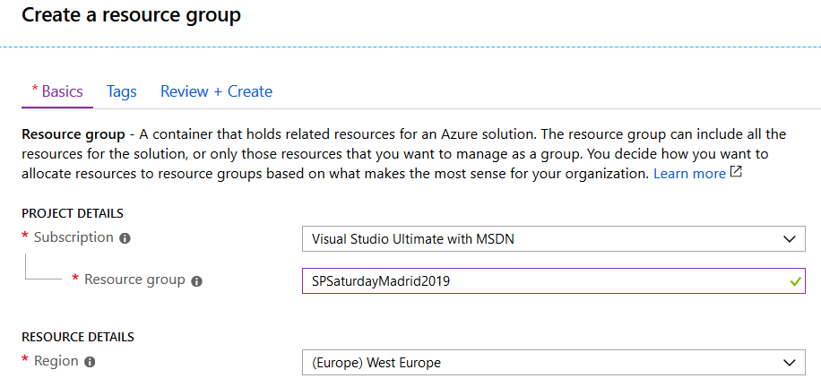
 
1. Seleccione el Grupo de Recursos creado en el punto anterior, utilice el botón de &quot;Add&quot; y en la casilla de búsqueda escriba &quot;storage&quot; y seleccione &quot;Storage account&quot;. Utilice el botón de &quot;Create en la nueva ventana. Seleccione el Grupo de Recursos (si no está seleccionado por defecto), asígnele un nombre al Storage y utilice &quot;Standard&quot; en &quot;Performance&quot;, &quot;StorageV2 (general purpose v2)&quot; en &quot;Acccount kind&quot;, &quot;Read-access geo-redundant&quot; en &quot;Replication&quot; y &quot;Hot&quot; en &quot;Access tier&quot;. Use el botón de &quot;Review + create&quot; para crear el storage

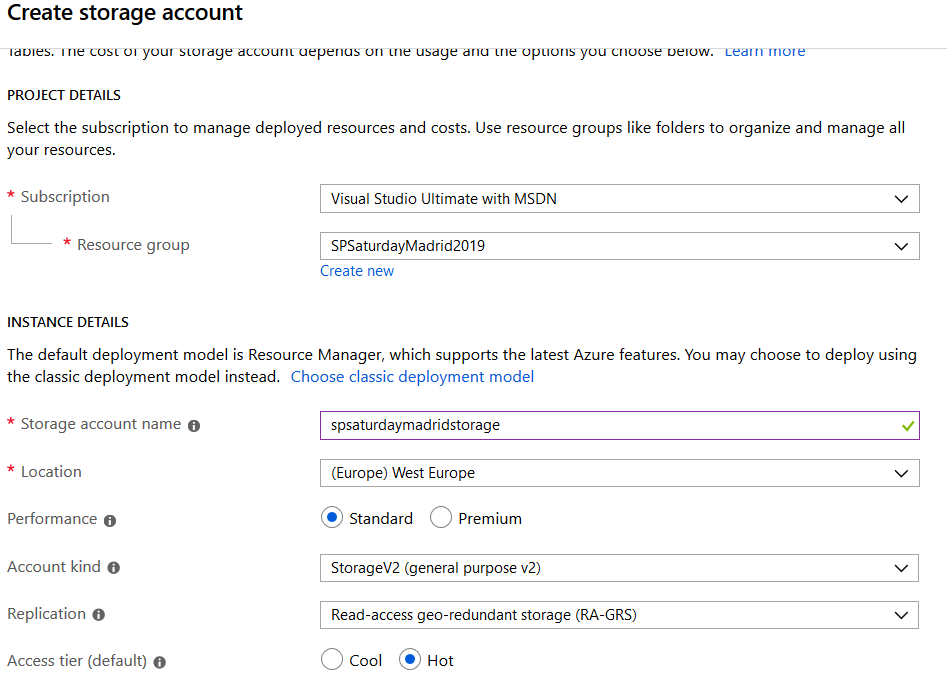

1. Seleccione el Grupo de Recursos de nuevo, utilice el botón de &quot;Add&quot; y en la casilla de búsqueda escriba &quot;functions&quot; y seleccione &quot;Function App&quot; en la lista resultados. Utilice el botón de &quot;Create&quot; en la nueva ventana. Una &quot;Function App&quot; es un contenedor de Funciones de Azure utilizado para agregar y organizar diferentes Funciones de una manera lógica.
2. En la ventana de creación de la Function App indique un nombre, la suscripción a utilizar y el Grupo de Recursos. Seleccione &quot;Windows&quot; como &quot;OS&quot;. Seleccione &quot;Consumption Plan&quot; en la casilla de &quot;Hosting Plan&quot; para pagar por servicio solamente cuando se utiliza, y la localización del Centro de Datos más cercano. Selecciones &quot;.NET&quot; en el &quot;Runtime Stack&quot; y el &quot;Storage&quot; creado anteriormente.

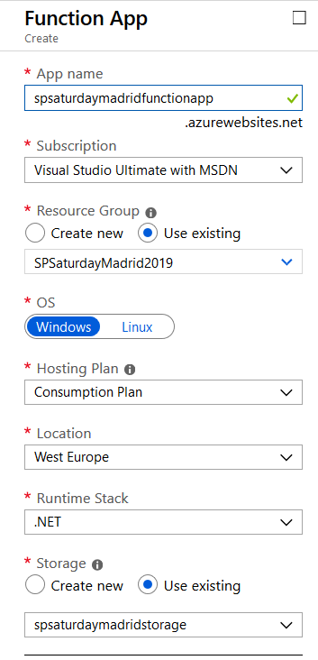

La Function App crea automáticamente un &quot;App Service Plan&quot;. Un servicio de &quot;Application Insights&quot; es creado también automáticamente para mantener información sobre el funcionamiento de las Funciones, pero puede ser configurado en la creación de la Function App si no se desea tener (y pagar por el):

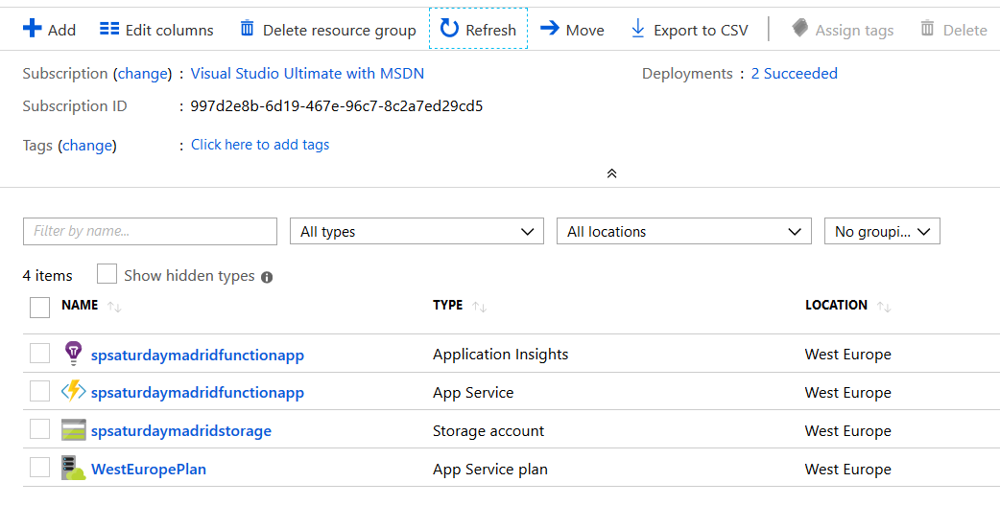

1. Una vez creada la Function App, haga clic sobre su nombre en la lista de recursos del Grupo de Recursos, lo que abre la ventana con la lista de Functions

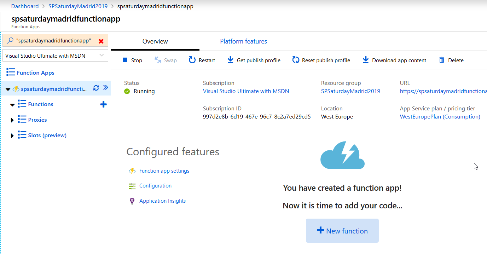

1. Haga clic sobre &quot;Platform features&quot; y use el vinculo de &quot;Function app settings&quot;. En la sección de &quot;Runtime version&quot; selección &quot;-1&quot; para cambiar la versión de funciones a utilizar (todo el código que se va a utilizar utiliza el .NET Framework, no el .NET Core Framework)
2. Haga clic sobre &quot;Functions&quot; y utilice el botón de &quot;New function&quot; para agregar una Función

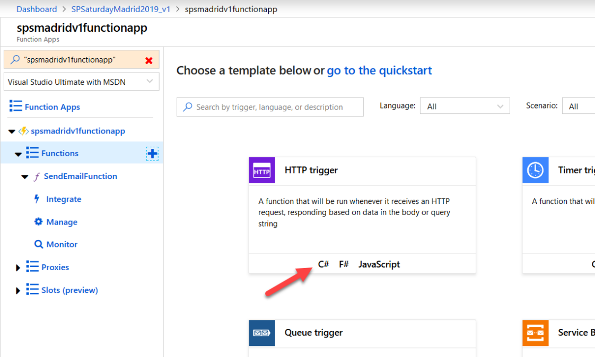

1. Haga clic sobre &quot;C#&quot; en el tipo de función &quot;HTTP trigger&quot;. En la ventana que abre automáticamente indique un nombre para la Función (&quot;SendEmailFunction&quot; en el ejemplo) y seleccione &quot;Function&quot; en la casilla de &quot;Authorization level&quot;

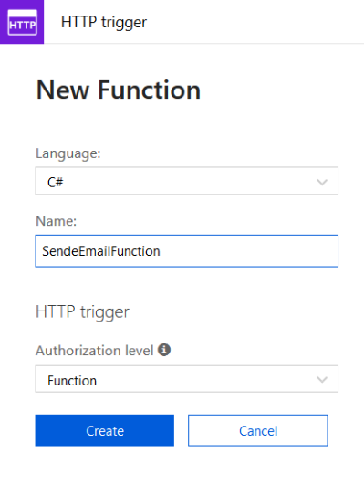

1. Azure crea la Función con un código básico de CSharp

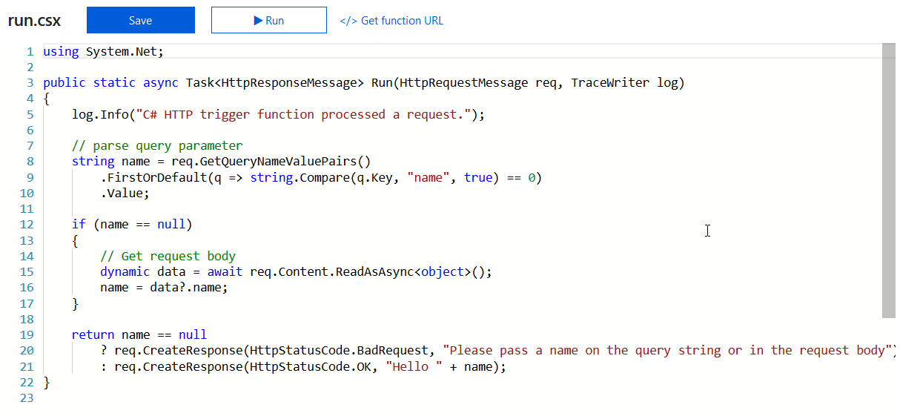

1. Desde la ventana de código de la Función, haga clic sobre el vínculo &quot;\&lt;/\&gt; Get function URL&quot; (al lado de los botones de &quot;Save&quot; y &quot;Run&quot;). Copie el URL que aparece (seleccionando &quot;default (Function key)&quot; en la sección de &quot;Key&quot;). Este URL es el que utiliza la WebPart de SPFx para enviar los parámetros de entrada e iniciar la ejecución. El parámetro &quot;code&quot; que aparece en el URL es el identificador que autoriza la llamada de la Función

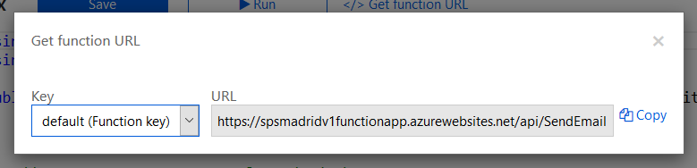

1. Como los navegadores impiden que una rutina de JavaScript haga llamadas externas al dominio base, es necesario configurar CORS (Cross-Origin Resource Sharing) en la Función En la ventana de manejo de las Funciones en Azure, haga clic sobre el nombre de la Function App (en el menú del lado izquierdo) y luego haga clic sobre &quot;Platform features&quot;. Luego haga clic de nuevo sobre &quot;CORS&quot; en la sección de &quot;API&quot;

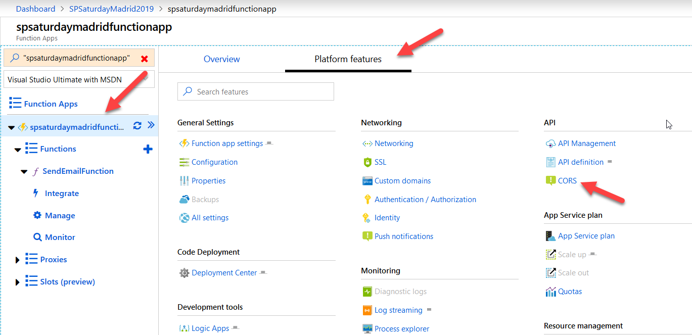

1. Agregue dos orígenes al final de los orígenes preconfigurados por Azure: uno a [https://localhost:4321](https://localhost:4321) que es el que va a utilizar el Workbench de SPFx, y otro a [https://[dominio].sharepoint.com](https://%5Bdominio%5D.sharepoint.com), que es el dominio del tenant de SharePoint 365 que va a contener la WebPart de SPFx. Guarde los cambios.

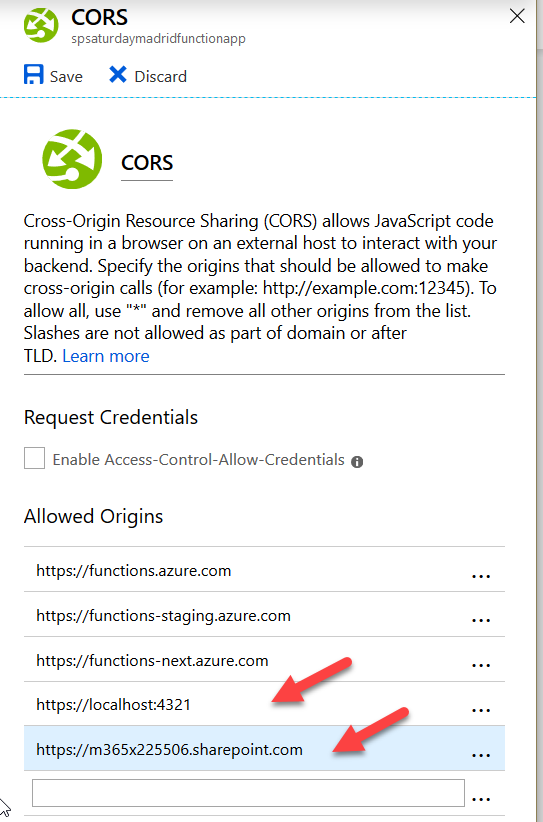

## Codificando la Función

Una vez creada la Función, es necesario programarla. La interface de Azure permite programar directamente utilizando el navegador, pero es posible utilizar Visual Studio 2016 (o superior) o Visual Studio Code, lo que permite utilizar Intellisence, debugging, etc. El ejemplo es tan sencillo que simplemente se va a utilizar el navegador para crear el código

1.
14.Reemplace todo el código creado por defecto por Azure con el siguiente fragmento

1. Reemplace los valores del URL de servidor de SMTP, la dirección de Email del usuario que envía el correo y el nombre de la cuenta y la clave necesarias para logearse en el servidor de SMTP. En el código, inicialmente se agrega una directiva a &quot;using System.Net.Mail&quot; que contiene los métodos para enviar Emails. La interface de SPFx va a enviar tres parámetros de entrada en el cuerpo de la llamada: &quot;EmailTo&quot;, &quot;EmailSubject&quot; y &quot;EmailBody&quot;, que son leídos y conservados en variables en la Función. La línea de &quot;log.Info&quot; solamente se utiliza para mostrar los parámetros de entrada en la Función como medida de monitoreo. Luego se configura el mensaje de Email (objeto &quot;myMail&quot;) y el servidor de SMTP (objeto &quot;mySmtpServer&quot;) para enviarlo, y se utiliza el método &quot;Send&quot; para transmitir el Email. Finalmente, el método &quot;return&quot; envía un mensaje de regreso a la WebPart de SPFx utilizando el objeto &quot;req&quot;, e indicando si el Email ha sido procesado correcta o incorrectamente
2. Utilice el botón de &quot;Save&quot;. La Función se puede testear directamente desde Azure utilizando la ventana de &quot;Test&quot; (lado derecho de la ventana de código) y configurando el body de la consulta con los valores apropiados. El procesamiento de la información se puede seguir por medio de la ventana de &quot;Logs&quot; (borde inferior de la ventana de código)

## Creación de la WebPart de SPFx

Nota: el sitio de MSDN sobre SPFx de Microsoft proporciona toda la información necesaria para realizar la configuración de las herramientas indispensables para programar con SPFx. Este articulo parte de la premisa de que ya se dispone de un sistema de desarrollo de SPFx configurado y listo para programar.

1. Cree un nuevo directorio en el computador de desarrollo, y una WebPart de SPFx en él utilizando el comando &quot;yo @microsoft/sharepoint&quot; (desde PowerShell):
  1. &quot;What is your solution name?&quot; SharePointSaturdayMadrid
  2. Utilice &quot;SharePoint Online only (latest)&quot;
  3. &quot;Where do you want to place the files?&quot; Use the current folder
  4. &quot;Do you want to allow...&quot; Yes
  5. &quot;Will the components in the solution...&quot; No
  6. &quot;Which type of client-side component to create?&quot; WebPart
  7. &quot;What is your Web part name?&quot; &quot;SendEmailWebPart&quot;
  8. &quot;What is your Web part description&quot; &quot;&quot;
  9. Which framework would you like to use?&quot; No JavaScript Frameword

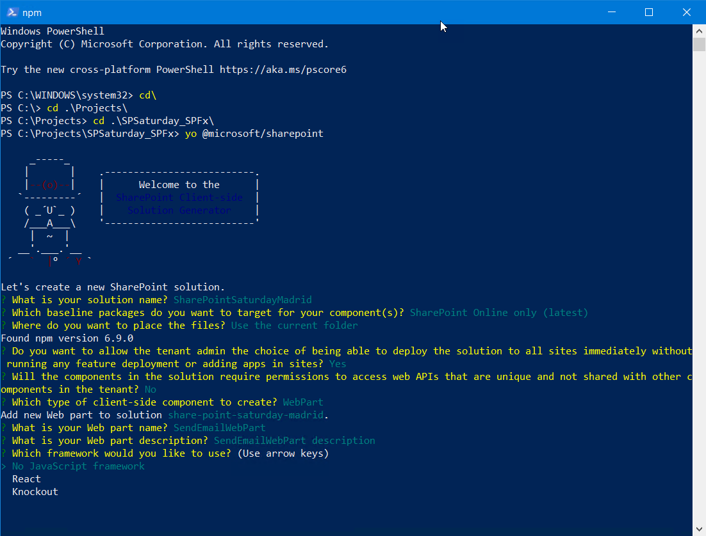

1. Una vez creada la WebPart, inicie Visual Studio Code y abra el archivo &quot;../src/webparts/sendEmailWebPart/SendEmailWebPartWebPart.ts&quot; que contiene el código de TypeScript de la WebPart. Reemplace todo el código con el siguiente fragmento:

import { Version } from&#39;@microsoft/sp-core-library&#39;;

import { BaseClientSideWebPart } from&#39;@microsoft/sp-webpart-base&#39;;

import {

  IPropertyPaneConfiguration,

  PropertyPaneTextField

} from&#39;@microsoft/sp-property-pane&#39;;

 // This are the JS Libraries to make HTTP calls

import { HttpClient, SPHttpClient, HttpClientConfiguration, HttpClientResponse, ODataVersion, IHttpClientConfiguration, IHttpClientOptions, ISPHttpClientOptions } from&#39;@microsoft/sp-http&#39;;

import styles from&#39;./SendEmailWebPartWebPart.module.scss&#39;;

import\*as strings from&#39;SendEmailWebPartWebPartStrings&#39;;

exportinterface ISendEmailWebPartWebPartProps {

  description: string;

}

exportdefaultclass SendEmailWebPartWebPart extends BaseClientSideWebPart\&lt;ISendEmailWebPartWebPartProps\&gt; {

  // This is the Azure Function URL and authentication code

  protected AzureFunctionUrl:

    string = &quot;https://nombrefunctionapp.azurewebsites.net/api/SendEmailFunction?code=qV3...I/Tg==&quot;;

  protected runFunction(): void {

    const requestHeaders: Headers = new Headers();

    requestHeaders.append(&quot;Content-type&quot;, &quot;application/json&quot;);

    requestHeaders.append(&quot;Cache-Control&quot;, &quot;no-cache&quot;);

    // Gather the information from the form fields

    var emailTo: string = (\&lt;HTMLInputElement\&gt;document.getElementById(&quot;txtEmailTo&quot;)).value;

    var emailSubject: string = (\&lt;HTMLInputElement\&gt;document.getElementById(&quot;txtEmailSubject&quot;)).value;

    var emailBody: string = (\&lt;HTMLInputElement\&gt;document.getElementById(&quot;txtEmailBody&quot;)).value;

    // Just log some information for debugging purposses

    console.log(`EmailTo: &#39;${emailTo}&#39;, EmailSubject: &#39;${emailSubject}&#39;, EmailBody: &#39;${emailBody}&#39;`);

    // This are the options for the HTTP call

    const callOptions: IHttpClientOptions = {

      headers: requestHeaders,

      body: `{ EmailTo: &#39;${emailTo}&#39;, EmailSubject: &#39;${emailSubject}&#39;, EmailBody: &#39;${emailBody}&#39; }`

    };

    // Create the responce object...

    let responseText: string = &quot;&quot;;

    let responceMessage: HTMLElement = document.getElementById(&quot;responseContainer&quot;);

    // And make a POST request to the Function

    this.context.httpClient.post(this.AzureFunctionUrl, HttpClient.configurations.v1, callOptions).then((response: HttpClientResponse) =\&gt; {

       response.json().then((responseJSON: JSON) =\&gt; {

          console.log(`Response From Azure [JSON]: &#39;${responseJSON}&#39;`);

          responseText = JSON.stringify(responseJSON);

          responceMessage.innerText = responseText;

        })

        .catch ((response: any) =\&gt; {

          console.log(`Response From Azure [Raw]: &#39;${response}&#39;`);

          let errorMessage: string = `Error calling ${this.AzureFunctionUrl} = ${response.message}`;

          responceMessage.innerText = errorMessage;

        });

    });

  }

  // This is the interface

  public render(): void {

    this.domElement.innerHTML = `

      \&lt;div class=&quot;${styles.sendEmailWebPart}&quot;\&gt;

        \&lt;div class=&quot;${styles.container}&quot;\&gt;

          \&lt;div class=&quot;ms-Grid-row ms-bgColor-themeDark ms-fontColor-white ${styles.row}&quot;\&gt;

            \&lt;div class=&quot;ms-Grid-col ms-u-lg10 ms-u-xl8 ms-u-xlPush2 ms-u-lgPush1&quot;\&gt;

              \&lt;span class=&quot;ms-font-xl ms-fontColor-white&quot;\&gt;Send an Email to any account\&lt;/span\&gt;

              \&lt;div class=&quot;${styles.controlRow}&quot;\&gt;

                \&lt;span class=&quot;ms-font-l ms-fontColor-white ${styles.controlLabel}&quot;\&gt;Email To:\&lt;/span\&gt;

                \&lt;input type=&quot;text&quot; id=&quot;txtEmailTo&quot;\&gt;\&lt;/input\&gt;

              \&lt;/div\&gt;

              \&lt;div class=&quot;${styles.controlRow}&quot;\&gt;

                \&lt;span class=&quot;ms-font-l ms-fontColor-white ${styles.controlLabel}&quot;\&gt;Subject:\&lt;/span\&gt;

                \&lt;input type=&quot;text&quot; id=&quot;txtEmailSubject&quot;\&gt;\&lt;/input\&gt;

              \&lt;/div\&gt;

              \&lt;div class=&quot;${styles.controlRow}&quot;\&gt;

                \&lt;span class=&quot;ms-font-l ms-fontColor-white ${styles.controlLabel}&quot;\&gt;Message:\&lt;/span\&gt;

                \&lt;input type=&quot;text&quot; id=&quot;txtEmailBody&quot;\&gt;\&lt;/input\&gt;

              \&lt;/div\&gt;

              \&lt;div class=&quot;${styles.buttonRow}&quot;\&gt;\&lt;/div\&gt;

              \&lt;button id=&quot;btnRunFunction&quot; class=&quot;${styles.button}&quot;\&gt;Send Email\&lt;/button\&gt;

              \&lt;div id=&quot;responseContainer&quot; class=&quot;${styles.resultRow}&quot;\&gt;\&lt;/div\&gt;

            \&lt;/div\&gt;

          \&lt;/div\&gt;

        \&lt;/div\&gt;

      \&lt;/div\&gt;`;

    // The Event Handler for the Button

    document.getElementById(&quot;btnRunFunction&quot;).onclick = this.runFunction.bind(this);

  }

  protectedget dataVersion(): Version {

    return Version.parse(&#39;1.0&#39;);

  }

  protected getPropertyPaneConfiguration(): IPropertyPaneConfiguration {

    return {

      pages: [

        {

          header: {

            description: strings.PropertyPaneDescription

          },

          groups: [

            {

              groupName: strings.BasicGroupName,

              groupFields: [

                PropertyPaneTextField(&#39;description&#39;, {

                  label: strings.DescriptionFieldLabel

                })

              ]

            }

          ]

        }

      ]

    };

  }

}

1. Inicialmente se declaran las librerías necesarias para el código, especialmente la que contiene los métodos para trabajar con llamadas de HTTP. En la variable &quot;AzureFunctionUrl&quot; copie el URL de la función que se encontró en el punto 11 de este ejemplo. En seguida se recuperan de la interfaz los valores del email a enviar, y se guardan en variables independientes. En la variable &quot;callOptions&quot; se definen las cabeceras y el cuerpo de la llamada de HTTP, y luego se crea otro objeto &quot;responceMessage&quot; para contener el resultado de la operación de llamada a la Función. Finalmente se hace una llamada POST al URL de la Función utilizando el método &quot;context.httpClient.post&quot;
2. En el mismo código, se define una interfaz para que el usuario pueda indicar los valores del Email: a quien se envía, el sujeto y el cuerpo del Email. La Función retorna un valor de éxito o fracaso que se muestra también en la interface

1.
21.La interfaz utiliza cuatro clases de css para mostrar los campos. Abra el archivo &quot;SendEmailWebPart.module.scss&quot; y agregue las siguientes clases:

1. Ejecute la WebPart utilizando el Workbench de SharePoint (comando &quot;gulp serve&quot;). Como la dirección local de testeo por defecto se ha configurado en CORS como se indica en el punto 13, la WebPart debe funcionar correctamente y ser capaz de enviar Emails directamente. Note el mensaje en el borde inferior de la WebPart que indica si el Email se envió correctamente, o si ha habido algún problema

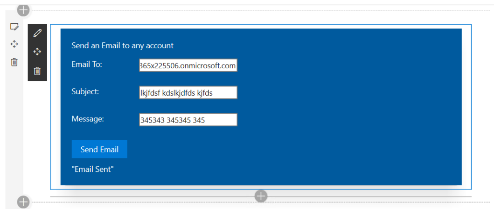

## Conclusiones

SPFx es el camino que Microsoft ha indicado para que en los próximos años podamos crear nueva funcionalidad para SharePoint 365. Pero SPFx, por su naturaleza de ser puro JavaScript, presenta una serie de desafíos y limitaciones que se pueden superar fácilmente utilizando Azure Functions. La combinación de ambos, SharePoint SPFx y Azure Functions representa la solución para muchos problemas, tanto técnicos como humanos.

Gustavo Velez
MVP Office Servers and Services
[http://www.gavd.net](http://www.gavd.net)
[gustavo@gavd.net](mailto:gustavo@gavd.net)

Alberto Diaz Martin
Azure MVP
@adiazcan