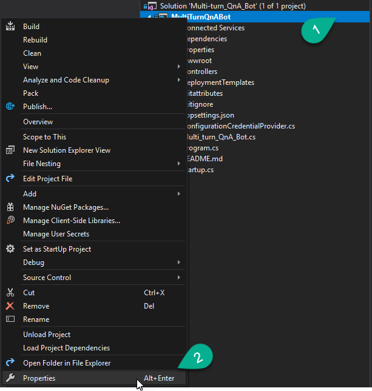
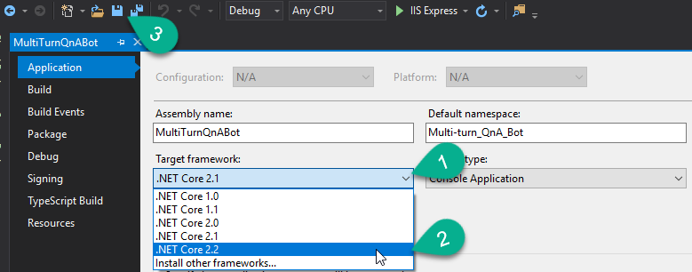
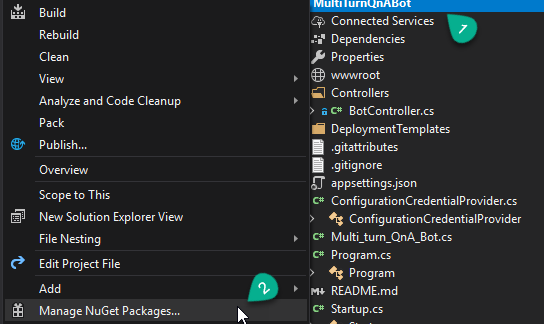

# 4 a Bot de QnA Simple
Vamos a implementar un bot de manera que cuando reciba un mensaje del usuario, se procese usando la librería de Bot.Builder.Ai.QnA, y le devolvamos el mensaje.
Comenzamos por actualizar el proyecto a la versión 2.2 de .Net Core
Clic derecho en el proyecto → clic en Properties

En Target framework, hacer clic en el desplegable → Elegir .Net Core 2.2 → Clic en Save

Este proyecto ha incrementado la versión del framework a 2.2 y no se ha visto afectado de ninguna manera. Por lo que vamos a ajustar la versión con la que se ha de ser compatible a la 2.2 en el método de ConfigureServices:
~~~ csharp
public void ConfigureServices(IServiceCollection services)
{
    services.AddMvc().SetCompatibilityVersion(CompatibilityVersion.Version_2_2);
    //...
}
~~~
En este mismo método, vamos a registrar el cliente http que utilizará el servicio de QnA:
~~~ csharp
services.AddHttpClient();
~~~
Para consumir el servicio de QnA vamos a utilizar la librería que nos provee Bot.Builder:

Haz clic con el botón derecho en el proyecto → Clic en Manage Nuget Packages…

Clic en browse → busca el paquete “Microsoft.Bot.Builder.AI.QnA” → Clic en “Microsoft.Bot.Builder.AI.QnA” → Clic en Install

Cuando te muestren los updates e instalaciones que se llevarán a cabo en la solución, clica en OK → Acepta los términos de las licencias
Cambiemos el nombre a la clase Empty Bot, por QnABot, que es donde vamos a utilizar esta librería.
Por inversión de control, el creador de esta clase, nos inyectará por constructor un objeto de tipo IConfiguration que usaremos para recuperar las credenciales del appsettings (es una [mala práctica, un servicio no debería depender de toda la configuración, solo de aquellas partes que le afectan](https://geeks.ms/etomas/2019/06/17/net-core-linux-error-system-io-ioexception-the-configured-user-limit-on-the-number-of-inotify-instances-has-been-reached/)); y el cliente de Http que utilizará el servicio de QnA:
~~~ csharp
public QnABot(IConfiguration configuration, IHttpClientFactory httpClientFactory)
{
    _configuration = configuration;
    _httpClientFactory = httpClientFactory;
}
~~~
Añadamos los atributos correspondientes a la clase:
~~~ csharp
private readonly IConfiguration _configuration;
private readonly IHttpClientFactory _httpClientFactory;
~~~
Recordemos que, hasta ahora, el único tipo de actividad que atendíamos era la de tipo Conversation Update, que atiende las actividades que indican que se ha añadido un miembro a la conversación.
Como queremos atender la actividad cuando un usuario nos envíe un mensaje, vamos a sobrescribir el método OnMessageActivityAsync para tratar las actividades de tipo mensaje que lleguen a nuestro bot.
~~~ csharp
protected override async Task OnMessageActivityAsync(ITurnContext<IMessageActivity> turnContext, CancellationToken cancellationToken)
{
// QnAService call
}
~~~ csharp
Demos funcionalidad al OnMessageActivityAsync. Vamos a Instanciar QnAMaker:
~~~ csharp
var httpClient = _httpClientFactory.CreateClient();

var qnaMaker = new QnAMaker(new QnAMakerEndpoint
                {
                    KnowledgeBaseId = _configuration["QnAKnowledgebaseId"],
                    EndpointKey = _configuration["QnAAuthKey"],
                    Host = _configuration["QnAEndpointHostName"]
                },
                null,
                httpClient);
~~~
Y utilicémoslo para recuperar las posibles respuestas a la query que nos ha enviado el usuario; en caso de no encontrar una respuesta adecuada, digamos al usuario que aún estamos aprendiendo y que nos pregunte otra cosa.
~~~ csharp
var response = await qnaMaker.GetAnswersAsync(turnContext);

if (response != null && response.Length > 0)
{
    await turnContext.SendActivityAsync(MessageFactory.Text(response[0].Answer), cancellationToken);
}
else
{
    await turnContext.SendActivityAsync(MessageFactory.Text("Aún estoy aprendiendo, pregúntame otra cosa."), cancellationToken);
}
~~~
En el fichero de appsettings.json vamos a rellenar estos parámetros (son los guardamos tras publicar la knowledge base de QnA):
~~~ json
"QnAKnowledgebaseId": "",
"QnAAuthKey": "",
"QnAEndpointHostName": ""
~~~
Vamos a probar que todo esto funciona.