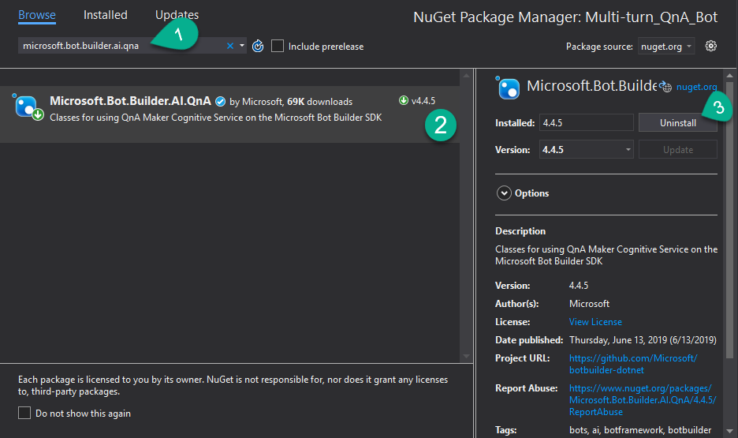

# 4 b Bot Multi-turno QnA
La gracia de un chatbot, es que pueda mantener una conversación con el usuario. El Servicio de QnA ya nos da las herramientas necesarias para crear toda una conversación, es decir, habrá varios turnos en la conversación.

Simulemos un ejemplo, tomemos las frases en verde como dichas por el usuario, las frases en negro como dichas por el bot, y las azules son las opciones que nos dará el bot para continuar con esta misma conversación.

Un único turno | Multiturno
-- | --
-	¿Tienes hambre? | -	¿Cómo desarrollo un bot?
-	Sólo tengo hambre de conocimientos | -	Podremos desarrollar el bot con diferentes lenguajes de programación… Ejemplos de .NET Core Ejemplos de Node.js Cognitive Services
- | -	Ejemplos en .Net Core
- | - Aquí tienes el repo con ejemplos de .NET Core…

Al recuperar la respuesta de QnA a través de la librería de Bot.Builder.AI.QnA obtenemos un Query Result con las propiedades: Questions, Answer, Score, Metadata, Source, e Id.
Para crear el bot multiturno utilizando QnAMaker, tenemos que recuperar además otra propiedad de nombre contexto.
Pongamos que, si le hago la pregunta “¿cómo desarrollo el bot?”, el servicio de QnA me dará un JSON que contiene, entre otras cosas, un objeto contexto:
~~~ json
"context": {
                "isContextOnly": false,
                "prompts": [
                    {
                        "displayOrder": 0,
                        "qnaId": 10,
                        "qna": null,
                        "displayText": "Ejemplos de .NET Core"
                    },
                    {
                        "displayOrder": 0,
                        "qnaId": 11,
                        "qna": null,
                        "displayText": "Ejemplos de Node.js"
                    },
                    {
                        "displayOrder": 0,
                        "qnaId": 12,
                        "qna": null,
                        "displayText": "Cognitive Services"
                    }
                ]
            }
~~~
Este objeto contiene los diferentes prompts que sirven como enlace a la siguiente respuesta de QnA, podemos decir que, contiene las opciones disponibles para seguir la conversación que hemos diseñado en el modelo de QnA.
Al recuperar la respuesta de QnA a través de la librería de Bot.Builder.AI.QnA obtenemos un QueryResult con las propiedades
~~~ json
"questions": [
                "Desarrollo",
                "Ayúdame a desarrollar el bot",
                "Pero el dame el código",
                "programación, por favor",
"¿cómo desarrollo el bot?”
            ],
            "answer": "Podremos desarrollar el bot con diferentes lenguajes de programación, actualmente en G.A. con .Net o Node.js. Para humanizar nuesto bot, recomendamos encarecidamente el uso de cognitive services.",
            "score": 100,
            "id": 9,
            "source": "Editorial",
            "metadata": [],
~~~
¡Nos falta el contexto! Por lo que esta librería ya no cubre nuestras necesidades. Vamos a desinstalarla:

Botón derecho en el proyecto → Manage Nuget Packages… → Escribe en la barra de búsqueda “Microsoft.Bot.Builder.Ai.QnA” → Selecciona el nuget → Clic en Uninstall

Vamos a crear un servicio que llame al api de QnAMaker.

En esta ocasión, vamos a configurar en la clase startup el httpClient para el servicio de QnA específicamente.

Vamos a la clase Startup → edita la línea

~~~ csharp
services.AddHttpClient();
~~~
Para transformarla en algo así
~~~ csharp
services.AddHttpClient<QnAService>(client =>
                {
                    client.BaseAddress = new Uri($"{Configuration["QnAEndpointHostName"]}/knowledgebases/{Configuration["QnAKnowledgebaseId"]}/");
                    client.DefaultRequestHeaders.Add("Authorization", $"EndpointKey {Configuration["QnAAuthKey"]}");
                }
            );
~~~
Creamos la carpeta Services, y una clase llamada QnAService.

A QnAService se le inyectará por constructor el httpClient que hemos configurado:
~~~ csharp
private readonly HttpClient _client;

public QnAService(HttpClient client)
{
    _client = client;
} 
~~~
Ahora, creemos el método GenerateAnswer. Este método llamará al api de QnAMaker, le pasará la query que nos ha escrito el usuario, recibirá una lista de posibles respuestas, y devolverá la primera que se encuentra (que es la que más puntuación ha obtenido).
~~~ csharp
internal async Task<QnAAnswerModel> GenerateAnswer(string message, string lang)
{
    QnAAnswerModel qnAResponse = null;

    string route = $"generateAnswer";

    var requestBody = JsonConvert.SerializeObject(new { question = message });

    HttpContent httpContent = new StringContent(requestBody, Encoding.UTF8, "application/json");

    var response = await _client.PostAsync(route, httpContent);

    if (response.IsSuccessStatusCode)
    {
        qnAResponse = (await response.Content.ReadAsAsync<QnAResponse>()).Answers.FirstOrDefault();
    }

    return qnAResponse;
}
~~~
Vamos a crear una carpeta Models, que va a contener:
Una clase que se llame QnAResponse, que contendrá una propiedad Answers:
~~~ csharp
public List<QnAAnswerModel> Answers { get; set; }
~~~
Una clase que se llame QnAAnswerModel que contrendrá:
~~~ csharp
public string Answer { get; set; }
public float Score { get; set; }
public int Id { get; set; }
public QnAContext Context { get; set; }
~~~
Una clase QnAContext que contiene:
~~~ csharp
public class QnAContext
{
    public bool IsContextOnly { get; set; }
    public List<Prompt> Prompts { get; set; }
}
~~~
Y, una Prompt que representa cada una de las opciones que daremos al usuario para continuar la conversación, que se compone de:
~~~ csharp
public int QnaId { get; set; }
public string DisplayText { get; set; }
~~~
Ahora vamos con la clase que implementa IBot y hereda de ActivityHandler.
Necesitaremos como atributo el servicio de QnA. Ya no necesitamos los atributos que teníamos en la versión anterior. Borrémoslos. Tendrá que quedar algo así:
~~~ csharp
private readonly QnAService _qnAService;

public QnABot(QnAService qnaService)
{
    _qnAService = qnaService;
}
~~~
Elimina el contenido del método OnMessageActivityAsync y sustituyelo por esto:
~~~ csharp
QnAAnswerModel response = await _qnAService
                            .GenerateAnswer(turnContext.Activity.Text, turnContext.Activity.Locale);
if (response != null)
{
    IEnumerable<string> suggestedActions = response.Context?.Prompts?.Select(p => p.DisplayText);
    
    if (suggestedActions != null)
    {
        if (string.Equals(turnContext.Activity.ChannelId, "msteams", System.StringComparison.InvariantCultureIgnoreCase)){

            List<CardAction> buttons = suggestedActions.Select(s => new CardAction(title: s)).ToList();
            HeroCard heroCard = new HeroCard(text: response.Answer, buttons: buttons);
            await turnContext.SendActivityAsync(
            MessageFactory.Attachment(new List<Attachment>() { heroCard.ToAttachment() }), cancellationToken);
        }
        else
        {
            await turnContext.SendActivityAsync(
            MessageFactory.SuggestedActions(
                suggestedActions,
                response.Answer), cancellationToken);
        }
    }
    else
    {
        await turnContext.SendActivityAsync(
            MessageFactory.Text(response.Answer), cancellationToken);
    }
}
else
{
    await turnContext.SendActivityAsync(MessageFactory.Text("Pues chica, no sé qué decirte."), cancellationToken);
}
~~~

Hemos tenido que meter una condición extra para que, si es teams, pinte el mensaje de manera distinta al que lo pintaría en otros canales.

Teams no renderiza suggested actions. Puedes hacer que Teams sea un canal de bot framework digno votando [aquí](https://microsoftteams.uservoice.com/forums/555103-public/suggestions/36025015-bot-support-for-suggested-actions)