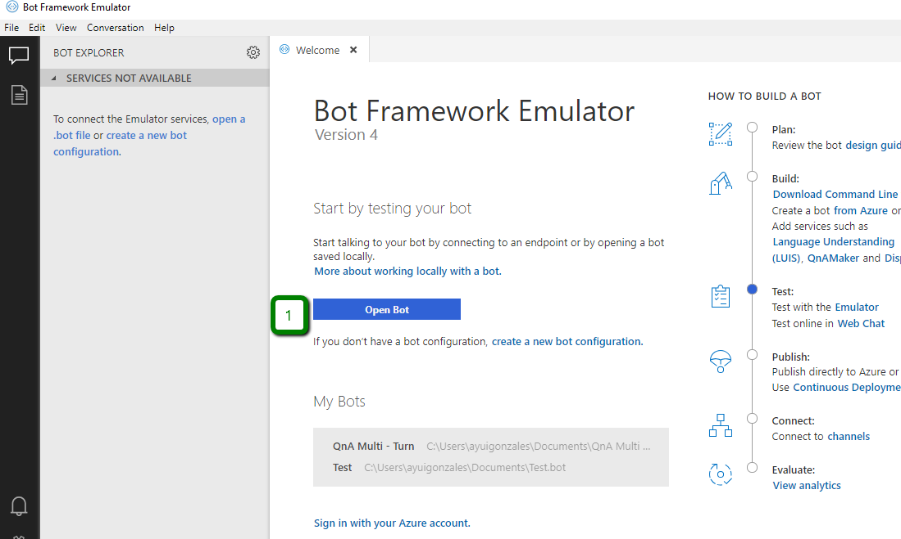
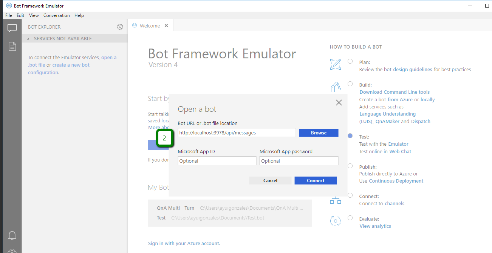
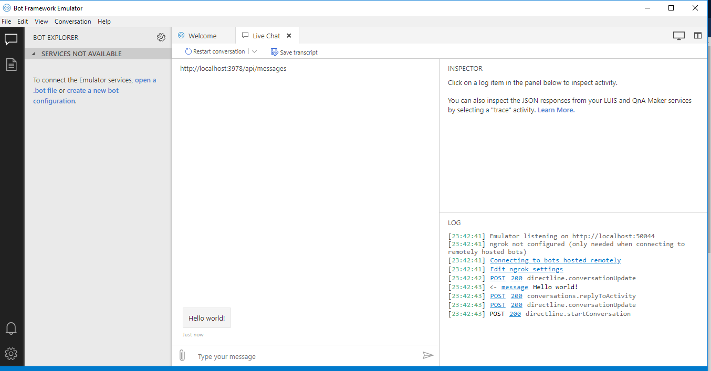

# 2 Pruebas con Bot Emulator

1. Depuramos el [Proyecto Inicial](./1ProyectoInicial.md) desde Visual Studio (F5)

2. Ejecutamos y Configuramos el Bot Emulator

3. Configuramos la ruta de la API y Conectamos.

4. El resultado debe ser el siguiente 

