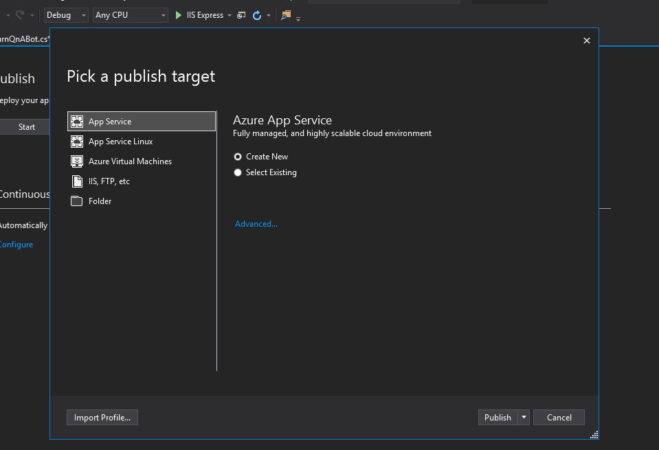
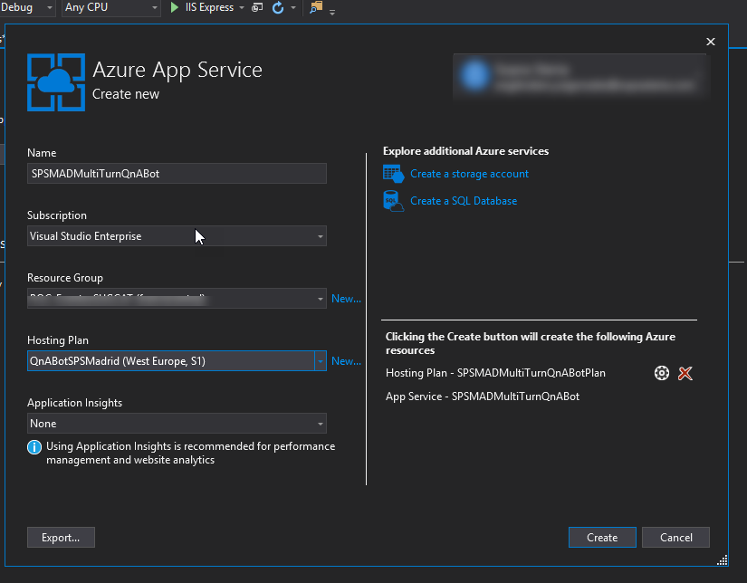
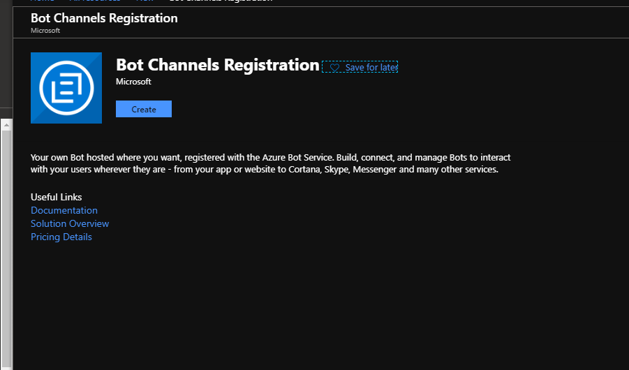
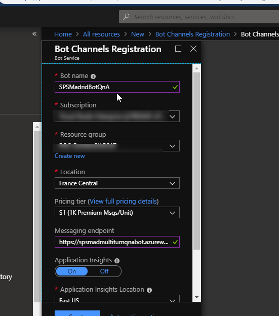
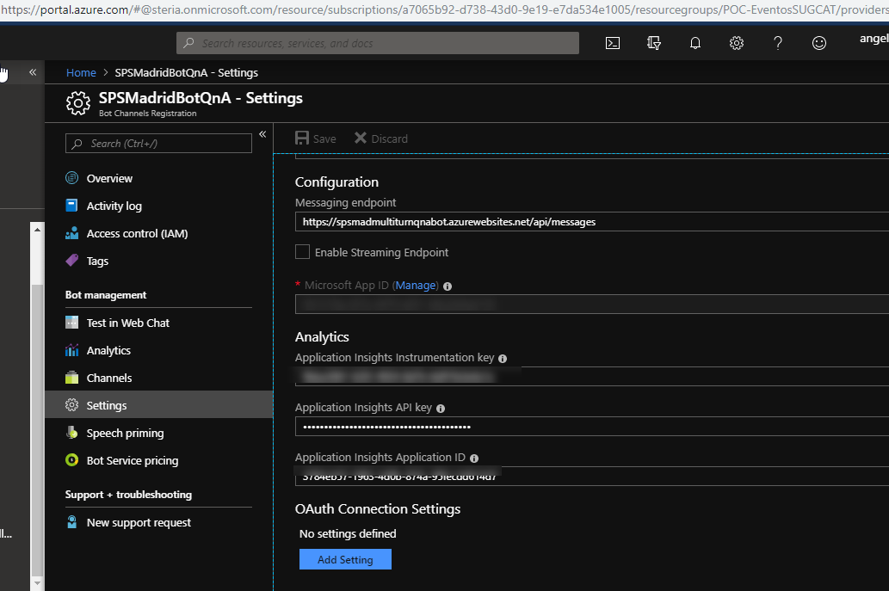
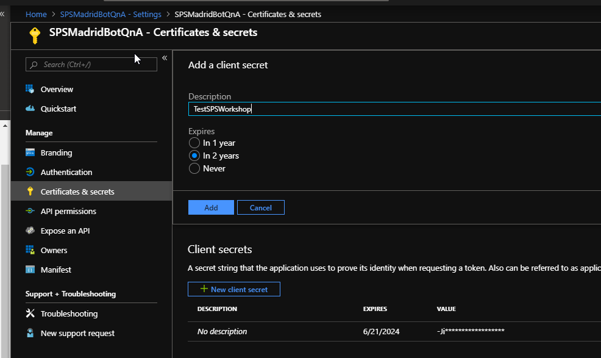
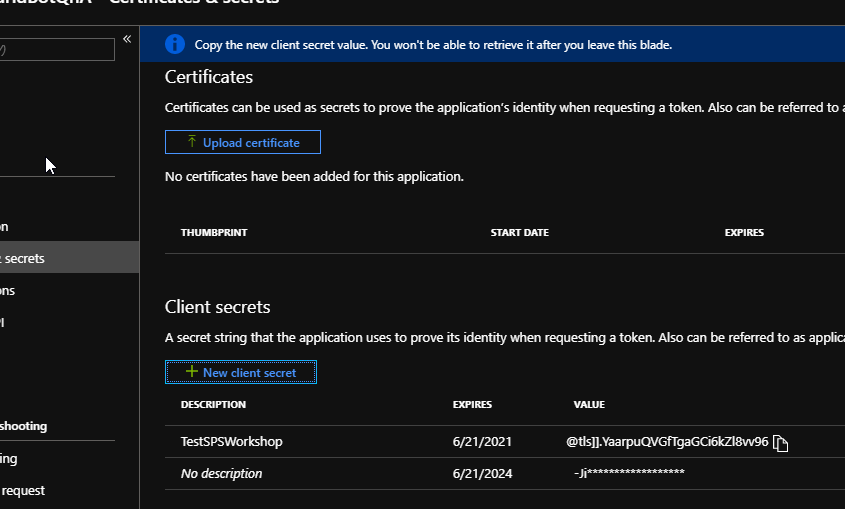
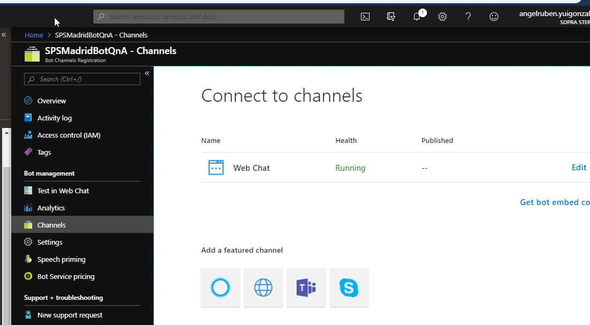
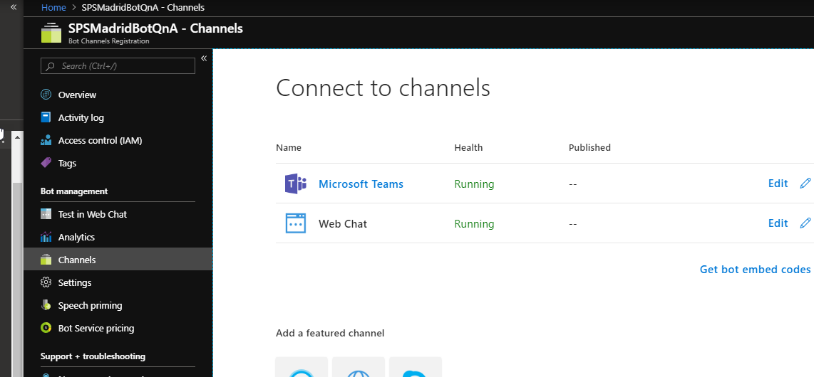

# 5 Publicación del bot en Azure

Publicaremos ahora el Bots en Azure como un servicio "Azure App Services" desde Visual studio:

Despues de realizar la publicación crearemos un **"Bot Channels Registration"** desde el **Portal de Azure**

Despues de la creación desde la configuración "Settings" seleccionamos **"Manage"** para las crear unas claves/token

Desde la configuración de canales tendremos que habilitar el **"Channel MS Teams"**

