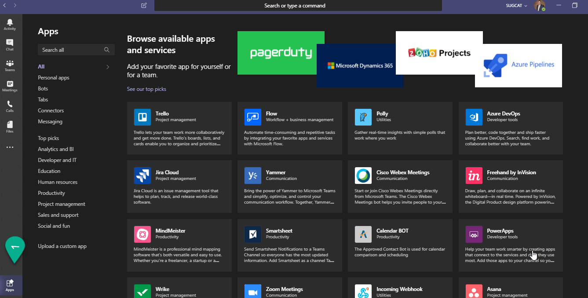
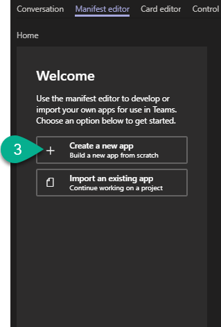
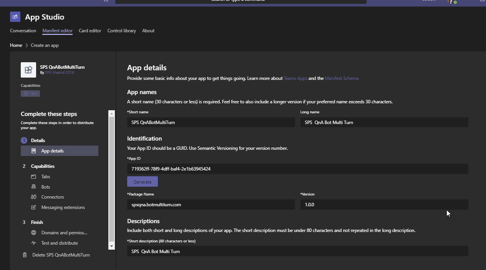
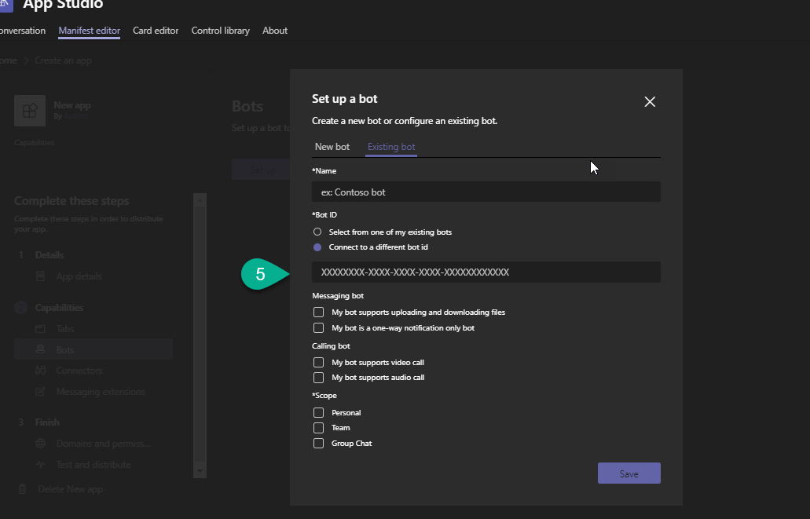
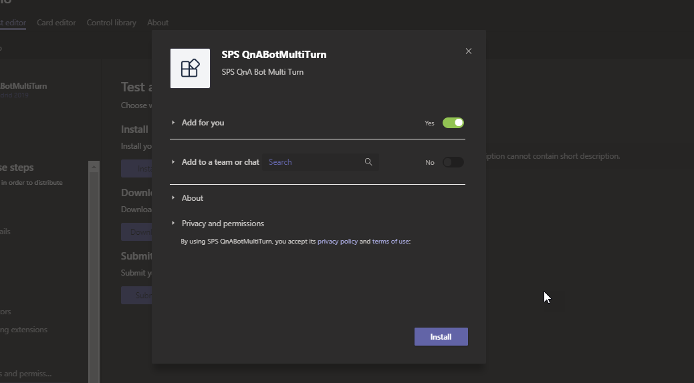
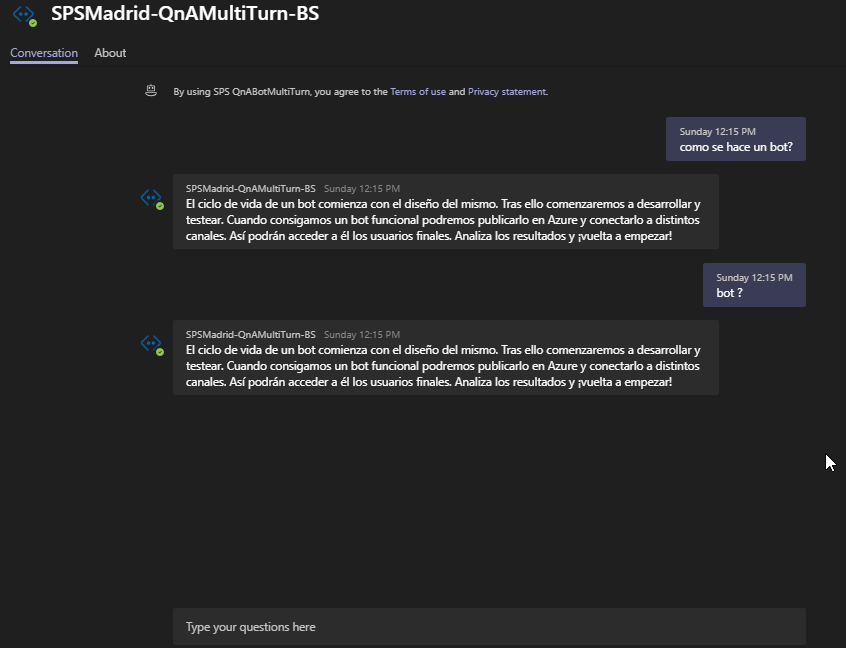

# 6 Publicar el Bots en MS Teams

Ejecutamos MS Teams y realizamos la instalación de la Apps [AppStudio] desde el store de Teams .

Al descargarse la aplicación, se abrirá el cliente Microsoft Teams con una ventana de diálogo para confirmar su registro.

Pulse en la pestaña de “Manifest Editor” y a continuación en “Create new app”:
.

Se abrirá entonces una pantalla desde la que tendremos que indicar los datos de nuestra aplicación y el tipo de aplicación. La pantalla estará dividida en diferentes secciones:

o Details, desde la que indicaremos la información general de la aplicación como el título, datos de soporte, versión, identificador,…
o Capabilities, donde seleccionaremos los elementos que dispondrá la aplicación, como una tab o un bot.
o Finish, con un resumen de los datos introducidos.

En la sección de “Capabilities” seleccionaremos “Bot” y “Setup”, desde donde indicaremos los datos de nuestro bot previamente creado.

En la ventana emergente de la pantalla de Setup, seleccionaremos la opción “Existin bot”:

o	El nombre del bot
o	El App Id
o	Las capacidades de envío de ficheros y mensajes.
o	El ámbito del bot, si será solo personal para conversaciones por chat o para Teams en un canal.

Desde la sección 3, pulsaremos en “Test and distribute” y pulsaremos en “Install” apra instalar localmente la aplicación de Teams antes de distribuirla.
o Selecciones el Team donde desea instalar la aplicación de prueba y pulse en “Instalar”.

Despues de instalar probaremos nuestro bot

