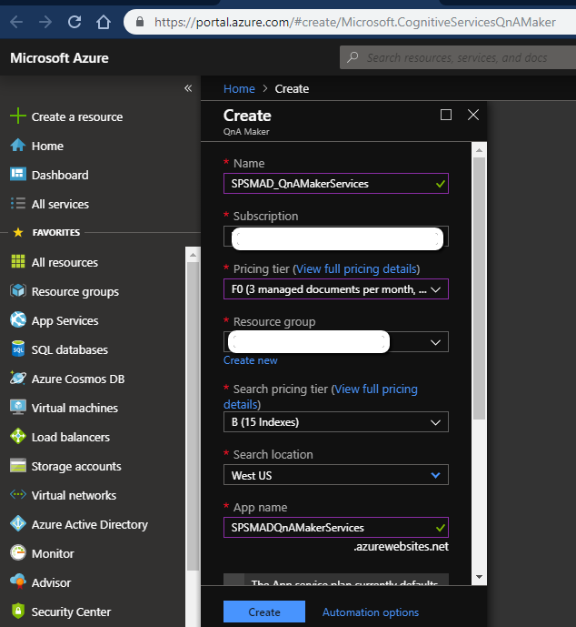
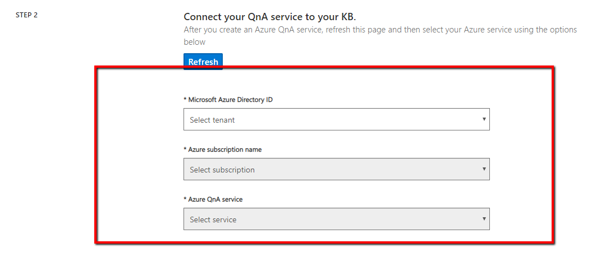
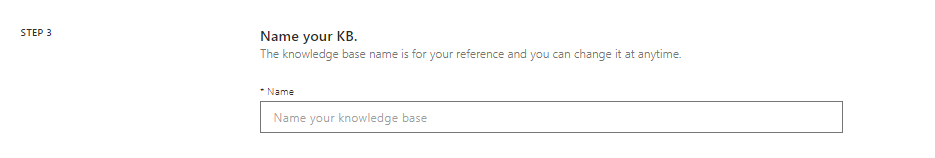
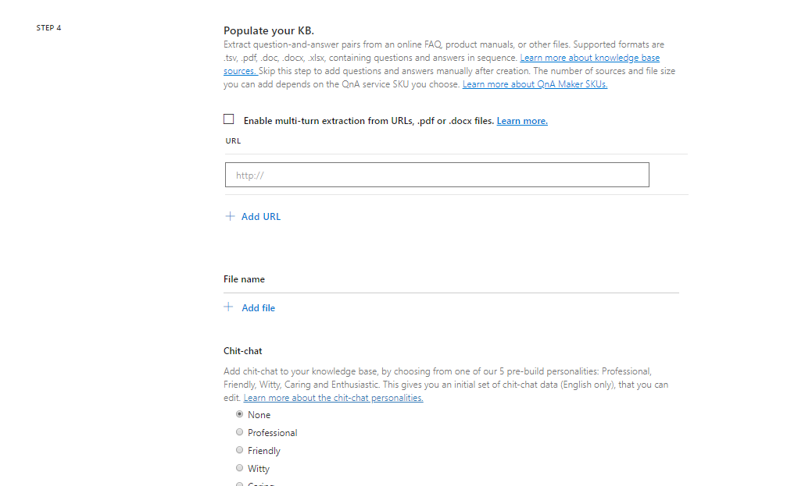
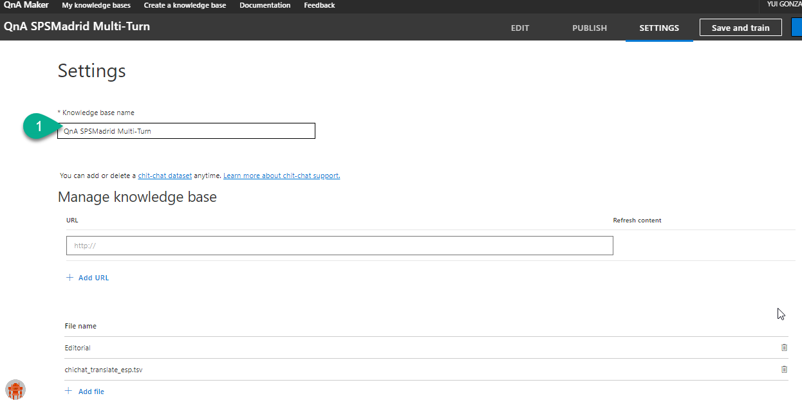
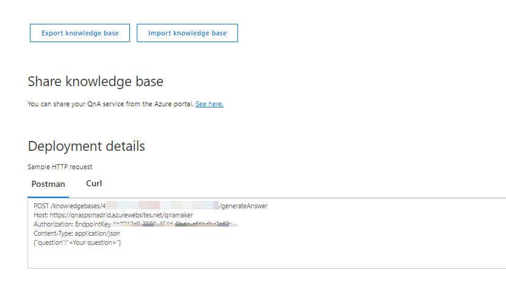
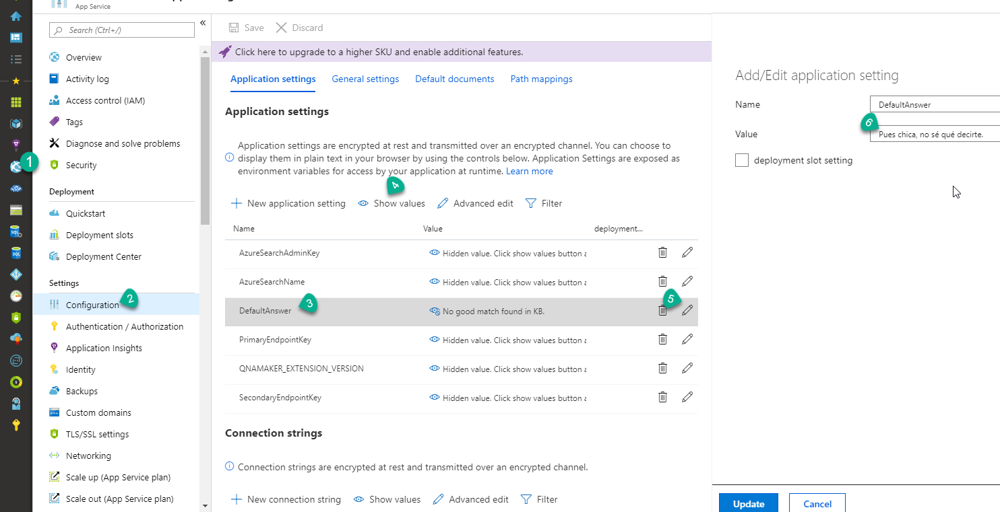

# 1 Creación de una base de conocimiento Multi Turno

Podéis crear la base de conocimiento desde la web de [QnAMaker](https://www.qnamaker.ai/), en la que se podrán crear y gestionar nuestras *Knowledge Base*, que no son más que conjuntos de datos con preguntas y respuestas. Los pasos a realizar son:

1. En una suscripción de Azure crear un *QnA Maker*.

2. [Crear una Knowledge Base](https://www.qnamaker.ai/Create), donde deberemos elegir el servicio de Azure creado previamente, indicar el nombre que queremos darle a esta base de conocimiento, así como el fichero o las URLs mediante las cuáles construir el Bot.

Indicamos el nombre "QnAMakerBot_SPSMAD"

Pulsamos Check en **"Enable multi-turn extraction from URLs, .pdf or .docx files."**

Adjuntamos el fichero [HowToCreateBot](./HowCreateBot.tsv)

3. Una vez tenemos la *Knowledge Base* podemos ver qué preguntas y respuestas contiene, y gestionar las entradas detectadas. Si realizamos cualquier modificación deberemos guardarla y entrenar al bot (save and train), para finalmente publicarla.

Ejecutando desde el postman esta ruta podemos realizar pruebas del servicio.

### [OPCIONAL]
El servicio de QnAMaker permite introducir una frase que mostrar al usuario cuando no encuentra ninguna otra respuesta adecuada. Por defecto, esta frase es "No good match found in KB"

Busca la web app de QnA que acabamos de crear → Clic en configuración → Clic en DefaultAnswer → Click en editar (lápiz) → Pon el valor que quieras responder al usuario cuando no encuentre ninguna respuesta adecuada para él.
