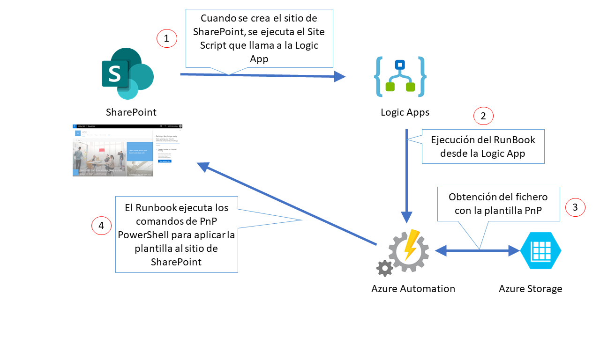
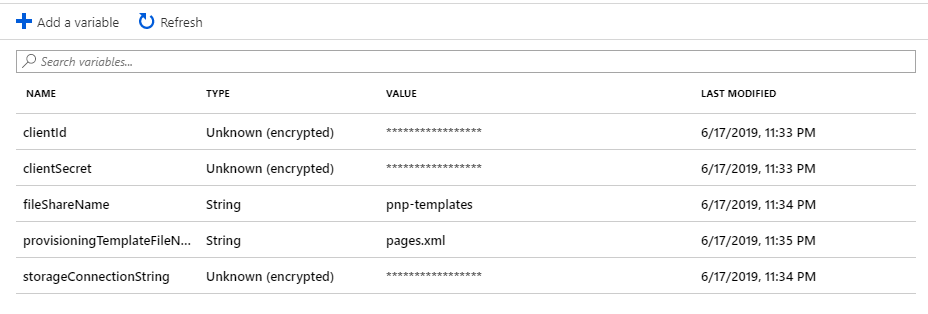
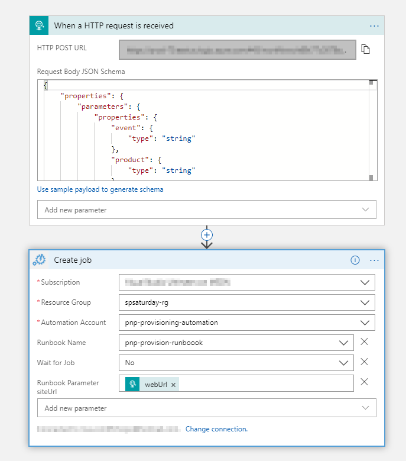
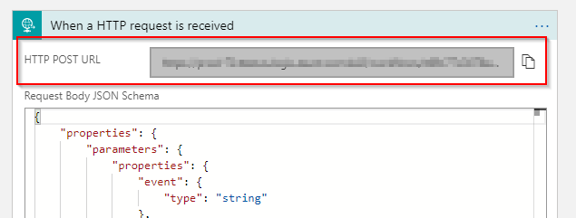
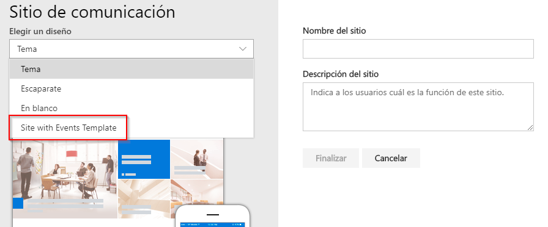
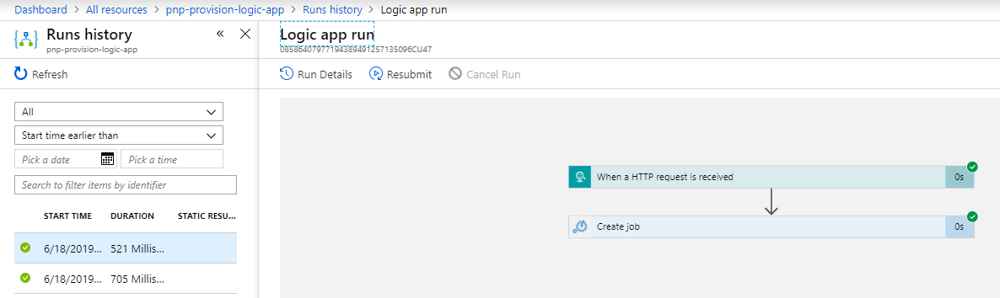
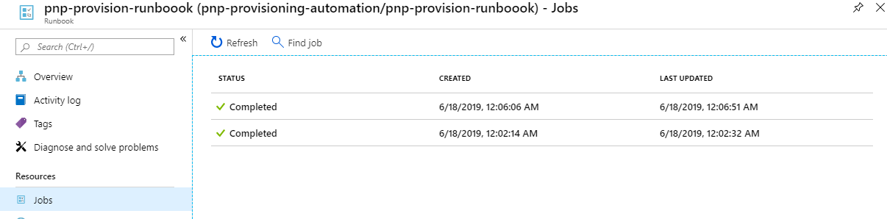

# SharePoint / Office 365 Saturday Madrid 2019

## Aprovisionamiento de un sitio de SharePoint con PnP PowerShell mediante Logic Apps y Azure Automation

### Introducción

Desde un Site Script es posible llamar a un Flow o una Logic App, de forma que podemos llevar a cabo multitud de acciones cuando se crea un sitio de SharePoint.
En el caso que nos ocupa, pretendemos llamar a una Logic App desde un Site Script, de forma que esta Logic App pueda llamar a un RunBook de Azure, que a su vez ejecutará una série de comandos de PnP PowerShell para poder aplicar una plantilla de aprovisionamiento sobre el sitio de SharePoint creado.



### Pasos

#### 1. Configurar el acceso a nuestro Tenant

Para poder acceder a nuestro tenant de Office 365 y poder ejecutar un script de PnP PowerShell podemos usar la autenticación basada en Apps. Para ello, deberemos seguir los pasos siguientes:

1.1. Ir a la siguiente dirección <https://[yourtenant].sharepoint.com/_layouts/15/appregnew.aspx>

1.2. Generar un _clientId_ y un _clientSecret_ haciendo click en los botones correspondientes.

1.3. Introducir un nombre para la aplicación (por ejemplo, _Site Provisioning_), el dominio y la URI, tal y como se muestra a continuación:


1.4. Hacer click en el botón _Create_.

1.5. Copiar los valores del _clientId_ y _clientSecret_, ya que los necesitaremos para ejecutar el script de PnP PowerShell.

1.6. Ir a la dirección <https://[yourtenant]-admin.sharepoint.com/_layouts/appinv.aspx>

1.7. En el campo _App Id_ pegar el _clientId_ generado anteriormente, y hacer click en el botón _LookUp_.

1.8. En el campo _Permission Request XML_ pegar el siguiente código:

```xml
<AppPermissionRequests AllowAppOnlyPolicy="true" >
    <AppPermissionRequest Scope="http://sharepoint/content/tenant" Right="FullControl" />
</AppPermissionRequests>
```

1.9. Elegir _Create_.

1.10. Para confirmar que confiamos en esta App, seleccionamos _Trust It_.

#### 2. Configuración de un recurso compartido de archivos en Azure

2.1. [Crear una cuenta de almacenamiento.](https://docs.microsoft.com/es-es/azure/storage/common/storage-quickstart-create-account)

2.2. [Crear un recurso compartido de archivos en Azure Files.](https://docs.microsoft.com/es-es/azure/storage/files/storage-how-to-create-file-share)

La cuota puede ser del espacio que queramos, ya que unicamente guardaremos los ficheros xml con las plantillas PnP que queremos usar para el aprovisionamiento.

2.3 Cargar el fichero [pages.xml](pages.xml) que contiene la definición PnP para desplegar una plantilla de página de contenido y una página de contenido.

2.4. Debemos guardarnos la [cadena de conexión](https://asparka.files.wordpress.com/2019/01/access-keys.png?w=625) a la cuenta de almacenamiento y el nombre del recurso compartido para poder utilizarlo posteriormente.

#### 3. Configuración de Azure Automation

3.1. [Crear una cuenta de Azure Automation.](https://docs.microsoft.com/es-Es/azure/automation/automation-create-standalone-account)

3.2. [Añadir el módulo de PnP PowerShell en la cuenta de Azure Automation.](https://docs.microsoft.com/es-es/azure/automation/automation-runbook-gallery)

3.3. [Crear un RunBook de tipo PowerShell.](https://docs.microsoft.com/es-es/azure/automation/manage-runbooks)

3.4. Editar el código fuente del RunBook y añadir el siguiente código:

```powershell
Param
(
  [Parameter (Mandatory= $true)]
  [String] $siteUrl
)
$appId = Get-AutomationVariable -Name "clientId"
$appSecret = Get-AutomationVariable -Name "clientSecret"
$storageConnectionString = Get-AutomationVariable -Name "storageConnectionString"
$fileShareName = Get-AutomationVariable -Name "fileShareName"
$provisioningTemplateFileName = Get-AutomationVariable -Name "provisioningTemplateFileName"
try {
    $tempFile = New-TemporaryFile
    $storageContext = New-AzureStorageContext -ConnectionString $storageConnectionString
    Get-AzureStorageFileContent -Context $storageContext -ShareName $fileShareName -Path "/$provisioningTemplateFileName" -Destination $tempFile -Force
    $tempFileContents = Get-Content $tempFile -Raw -ErrorAction:SilentlyContinue
    $inMemoryProvisioningTemplatePath = $tempFile.FullName
    Connect-PnPOnline -Url $siteUrl -AppId $appId -AppSecret $appSecret
    Apply-PnPProvisioningTemplate -Path $inMemoryProvisioningTemplatePath
}
catch {
    Write-Output "Error occured: $PSItem"
}
finally {
    Disconnect-PnPOnline
}
```

Esta función de PowerShell espera por parámetro la Url del sitio de SharePoint donde aplicar la plantilla de PnP. Adicionalmente, necesita los siguientes datos:

* _clientId_ y _clientSecret_ para poder conectarse al sitio de SharePoint.

* _storageConnectionString_ para poder conectarse a la cuenta de almacenamiento de Azure.

* _fileShareName_ para poder localizar el fichero en el recurso compartido.

* _provisioningTemplateFileName_ con el nombre del fichero xml con la plantilla a aplicar (en nuestro caso, el fichero se llama _pages.xml_).

3.5. Por lo tanto, necesitamos crear estas 5 [variables](https://blog.ipswitch.com/hs-fs/hubfs/pic1.png?width=1432&name=pic1.png) con sus respectivos valores en la cuenta de Azure Automation para que las pueda usar el RunBook (podemos guardarlas cifradas todas ellas).



#### 4. Creación de la Logic App que llamará al RunBook de Azure Automation

4.1. [Crear una Logic App](https://docs.microsoft.com/es-es/azure/logic-apps/quickstart-create-first-logic-app-workflow)

4.2. La Logic App ejecutará el RunBook de Azure Automation cuando reciba una petición, de forma que debería contener las acciones que se pueden ver a continuación:



El cuerpo de la petición de la solicitud HTTP debería contener el código siguiente, de forma que se pueda identificar el sitio de SharePoint desde el que se está lanzando la petición:

```json
{
     "type": "object",
     "properties": {
         "webUrl": {
             "type": "string"
         },
         "parameters": {
             "type": "object",
             "properties": {
                 "event": {
                     "type": "string"
                 },
                 "product": {
                     "type": "string"
                 }
             }
         }
     }
 }
 ```

#### 5. Creación de un site script para llamar a la Logic App

5.1. Debemos crear un fichero JSON con la siguiente estructura:

```json
{
    "$schema": "schema.json",
    "actions": [
    {
            "verb": "triggerFlow",
            "url": "",
            "name": "Apply Template",
            "parameters": {
                "event":"",
                "product":""
            }
    }
    ],
    "bindata": {},
    "version": 1
}
```

Donde en el parámetro ___url___ debemos indicar la url generada por la acción de solicitud HTTP de la Logic App.



5.2. Una vez creado el fichero (por ejemplo, lo podemos llamar _call-logic-app.json_), debemos crear una Site Script que haga referencia a éste.

```powershell
Get-Content .\call-logic-app.json -Raw | Add-SPOSiteScript -Title "Call Logic App"
```

Deberemos guardarnos el Id generado para usarlo en el siguiente paso.

5.3. Finalmente, añadiremos el Site Script a un Site Design que ya existiese, por ejemplo:

```powershell
Set-SPOSiteDesign -Identity 57cea269-b041-4b11-bbf2-aaec0217eed2 -SiteScripts 5d356241-902d-4c25-887a-ebb3daa3de8d 
```

Donde los Ids de Site Design y Site Script son un ejemplo y ___deben sustituirse por vuestros Ids___ .

#### 6. Comprobación

Para poder probar el correcto funcionamiento de la arquitectura, deberíamos crear un nuevo sitio de SharePoint, seleccionando el Site Design donde hemos añadido nuestro Site Script que llama a la Logic App.



Al crear el sitio de SharePoint, deberíamos comprobar que se llama a la Logic App correctamente:



Y posteriormente comprobar que se ha ejecutado correctamente el RunBook.



Finalmente, comprobaremos si existe la plantilla de página en el sitio de SharePoint creado.


Esperamos que hayas podido completar el laboratorio de forma satisfactoria, y si tienes alguna duda, no dudes en preguntarnos.

__Sharing is Caring!__

