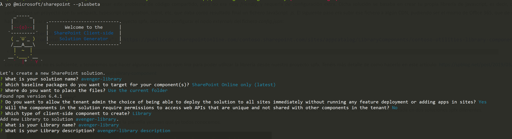
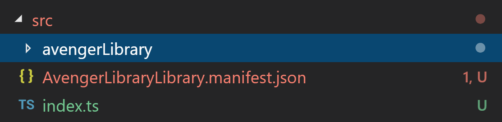

#Library Components
Uno de los aspectos más importante dentro de los equipos de desarrollo es empezar a reutilizar aquellos componentes que se repiten proyecto tras proyecto. En base a esta idea en la comunidad SharePoint han salido proyectos internacionales como PnP o proyectos locales como ENMARCHA. Ahora bien, estan muy chulas estas inicativas que agilizan el desarrollo/aprovisionamiento de nuestra solución, pero como podemos compartir elementos visuales para no tener que estar siempre haciendolos. Al final a los superheroes no nos gusta siempre estar haciendo lo mismo, nos gusta estar enfrentandonos a nuevos villanos/retos. Si eso lo trasladamos a SPFx seria nos gusta estar haciendo cosas nuevas y no siempre el mismo People Picker proyecto tras proyecto que tiene funcionalidad cuanto menos "similar".
Sin embargo a pesar que esta solución esta muy bien y puede cumplir con mucho de los requerimientos desde mi punto de vista se queda corta para nuestras necesidades. En estas libreria de Componentes 
: crearnos nuestro propio paquete npm https://medium.com/@nilayvishwakarma/build-an-npm-package-with-typescript-by-nilay-vishwakarma-f303d7072f80 y publicarlo en un feed privado en el Azure DevOps o bien uno público en NPM. Cuales son los principales inconvenientes de esto para los desarrolladores de SharePoint, el conocimiento de algunas herramientas que no forman parte de nuestro día a día. Con SPFx la configuración del Webpack pasa desapercibida, la generación del bundle practicamente no se hace (aunque algunos aspectos si que intenamos mejorarlos para evitar duplicidad de librerias, etc.. ).
Una opción que no me planteo es el estar duplicando código de solución en solución, los principales inconvenientes de esto creo que es de sobra conocidos:
    - un fallo en uno de ellos un fallo que hay modificar en todos los sitios donde lo hayamos puesto
    - como incorporamos nuevas funcionalidades a un componente? 
    - como lo actualizamos?

Dada esta necesidad, desde el la comunidad PnP se pusieron manos a la obra en lo que llos han llamdo Library Components. ¿Que son? No son más que un componente que instalamos y lo podemos referenciar en cualquier de los proyectos/webparts/soluciones que estamos implementando. Actualmente esta característica esta en Preview por lo que no se puede usar en entornos productivos pero si que es bueno empezar a conocerla para poder usarla en cuanto este disponible en GA.

##Creación de un componente de Lista de Pinterest 
Cree un directorio de proyecto en su ubicación favorita
md corporate-library

Vaya al directorio del proyecto
cd corporate-library
Cree una nueva biblioteca ejecutando los bits beta del generador de SharePoint de Yeoman
yo @microsoft/sharepoint --plusbeta
Cuando se le pida:
Acepte el nombre de solución corporate-library predeterminado y presione Entrar.
Seleccione Solo SharePoint Online (más reciente) y presione Entrar.
Seleccione Usar la carpeta actual para colocar los archivos.
Seleccione Y para permitir que la solución se implemente en todos los sitios inmediatamente.
Seleccione N en la pregunta sobre si la solución contiene permisos exclusivos.
Seleccione Biblioteca como tipo de componente del lado cliente que se va a crear.
En el siguiente conjunto de preguntas, se le pedirá información específica sobre la biblioteca:
Cambie el nombre predeterminado de la biblioteca a CorporateLibrary como nombre para su biblioteca y seleccione Entrar.


Acepte la descripción CorporateLibrary predeterminada como descripción de su biblioteca y seleccione Entrar.
Una vez que se haya realizado el scaffolding del proyecto, verá la biblioteca creada con un archivo index.ts que contiene una exportación de la CorporateLibrary creada.

Si vemos la solución tendremos un fichero manifest en el que tenemos el identificador de nuestra libreria de clases. un Fichero index.ts en el que deberemos de indicar todos los artefactos que se van a incluir en la biblioteca y luego ya la estructura que consideremos oportuna para el componente que vamos a implementar.

## Crearemos un componente ListAvengers
Dentro de la carpeta nos crearemos dos carpetas: Components y Model. En este caso dependiendo del tipo del componente que vayamos a añadir optaremos por una cosa u otra. 
Dentro de la carpeta "Model" añadiremos el siguiente fichero 'iavenger.ts' que contendrá el siguiente código:

```js
export default interface IAvengers {
    id:string;
    name:string;
    description:string;
    image:string;    
}
```
Dentro de la carpeta "Components" crearemos un fichero 'listAvenger.ts' que tiene la siguiente estructura
```js
import * as React from 'react';
import IAvenger from '../model/iavengers';

export interface IListAvengerProps {
    avengerCollection:IAvenger[];
}


export default class ListAvenger extends React.Component<IListAvengerProps, any> {
    
    constructor(props:IListAvengerProps) {
        super(props);
  
    }
    public render() {    
        
       const evengerCollection:IAvenger[]=this.props.avengerCollection;
    
        let i:number=0;       
return (

<div className="container">
<div className="row">
<div className="col-lg-12 my-3">
            <div className="pull-right">
                <div className="btn-group">
                </div>
            </div>
        </div>
    </div> 
    
    <div id="products" className="row view-group">
        {            
            evengerCollection.map((item:IAvenger)=>{
                i=i+1;
                return (
                    <div className="item col-xs-4 col-lg-4" key={item.id}>
                    <div className="thumbnail card">
                        <div className="img-event">
                            
                        </div>
                        <div className="caption card-body">
                            <h4 className="group card-title inner list-group-item-heading">
                                {item.name}</h4>
                            <p className="group inner list-group-item-text">
                                {item.description}
                            </p>
                            <div className="row">                                
                                <div className="col-xs-12 col-md-6">
                                    
                                </div>
                            </div>
                        </div>
                    </div>
                </div>                );                
            })
        } 
   </div>                    
</div>);
    }
}
```
Que tiene este código, por un lado lo que tiene es un componente ReactJS que en las Props esta esperando una lista de la Clase de vengadores para que se pinten de acuerdo a un diseño. En esta parte se puede complicar ya todo lo que queramos de acuerdo a nuestras necesidades.

Por último para que nuestro componente se añada en dentro del componente tendremos que modificar el index.ts que habiamos comentado en el inicio. Nuestro fichero quedaria de la siguiente forma:
```js
export { default as ListAvenger} from './avengerLibrary/components/avengerList';
```
Una vez creada la solución lo que deberemos de hacer es comprobar que funciona para ello compilaremos la solución:
```js
gulp bundle
```

## Probando nuestra solución
Ahora bien ya tenemos nuestra libreria de componentes lista para poder utilizarla en todos nuestros proyectos :) Pero como lo hacemos. 
Nos crearemos una carpeta donde añadiremos un WebPart en el que importaremos el componente que acabamos de crear.
```js
yo microsoft/sharepoint 
```
Una vez creado el proyecto, debemos añadir una dependencia a nuestra Library. Esto lo haremos editando el package.json y añadiendo un dependencia más dentro de las DevDependencies en mi caso quedaria de la siguiente forma:
```js
  "devDependencies": {
    "@microsoft/sp-build-web": "1.8.2",
    "@microsoft/sp-tslint-rules": "1.8.2",
    "@microsoft/sp-module-interfaces": "1.8.2",
    "@microsoft/sp-webpart-workbench": "1.8.2",
    "@microsoft/rush-stack-compiler-2.9": "0.7.7",
    "avenger-library":"0.0.1",
    "gulp": "~3.9.1",
    "@types/chai": "3.4.34",
    "@types/mocha": "2.2.38",
    "ajv": "~5.2.2"
  }
```
Una vez añadida la solución, iremos a la clase de React que se ha creado en el scaffoding y añadiremos nuestro componente, para ello el fichero quedaria de la siguiente forma:
```js
import * as React from 'react';
import styles from './AvengerPeoplePicker.module.scss';
import { IAvengerPeoplePickerProps } from './IAvengerPeoplePickerProps';
import { escape } from '@microsoft/sp-lodash-subset';
import { ListAvenger } from 'avenger-library';​
import IAvengers from 'avenger-library/lib/avengerLibrary/model/iavengers';
export default class AvengerPeoplePicker extends React.Component<IAvengerPeoplePickerProps, {}> {
public avengerCollection:IAvengers[]=[];
  constructor(props:any) {
    super(props);
    const hulkAvenger:IAvengers= {
      id: "2",
      name: "Hulk",
      image: "https://i.kinja-img.com/gawker-media/image/upload/s--gA6KuMPG--/c_scale,f_auto,fl_progressive,q_80,w_800/qtlzkj1nt13ybo6e3an8.jpg",
      description: "Hulk con el mismo tacto que un servidor"
    };
    const viudaNegra:IAvengers=    {
      id: "5",
      name: "Viuda Negra",
      image: "http://es.web.img3.acsta.net/newsv7/18/12/30/15/11/1409920.jpg",
      description: "A quién se parece :)"
    };
    const capitanAmerica:IAvengers={    
      id: "4",
      name: "Capitan Azure",
      image: "https://img-cdn.hipertextual.com/files/2018/11/avengers-infinity-war-captain-america.jpg?strip=all&lossy=1&quality=70&resize=740%2C490&ssl=1",
      description: "Os suena este??"
    };
    this.avengerCollection.push(hulkAvenger);
    this.avengerCollection.push(viudaNegra);
    this.avengerCollection.push(capitanAmerica);
  }

public render(): React.ReactElement<IAvengerPeoplePickerProps> {
    return (
      <div className={ styles.avengerPeoplePicker }>
              <ListAvenger avengerCollection={this.avengerCollection}></ListAvenger>
      </div>
    );
  }
}
```

Ahora bien si hacemos esto nos indica que el modulo "avenger-library" no lo encuentra. Para que lo encuentre debemos de realizar una serie de pasos de forma manual. En primer lugar nos iremos a la raiz de la carpeta donde hemos creado nuestra libreria y debemos de ejecutar el siguiente comando:
```js
npm link
```
Una vez hemos creado el link el siguiente paso es irnos a la carpeta donde hemos creado el webpart e indicar que la libreria de componentes la tiene referenciada en una ruta establecida. Para ello se ejecutaría el siguiente comando:
```js
npm link avenger-library
```
Este comando lo que hace es añadir en la carpeta node_modules nuestra libreria de componentes. 
Ahora bien para ver que nuestra libreria funciona ejecutaremos el worbench y comprobamos que funciona.
```js
gulp serve
```
Si todo va bien veriamos la siguiente imagen


