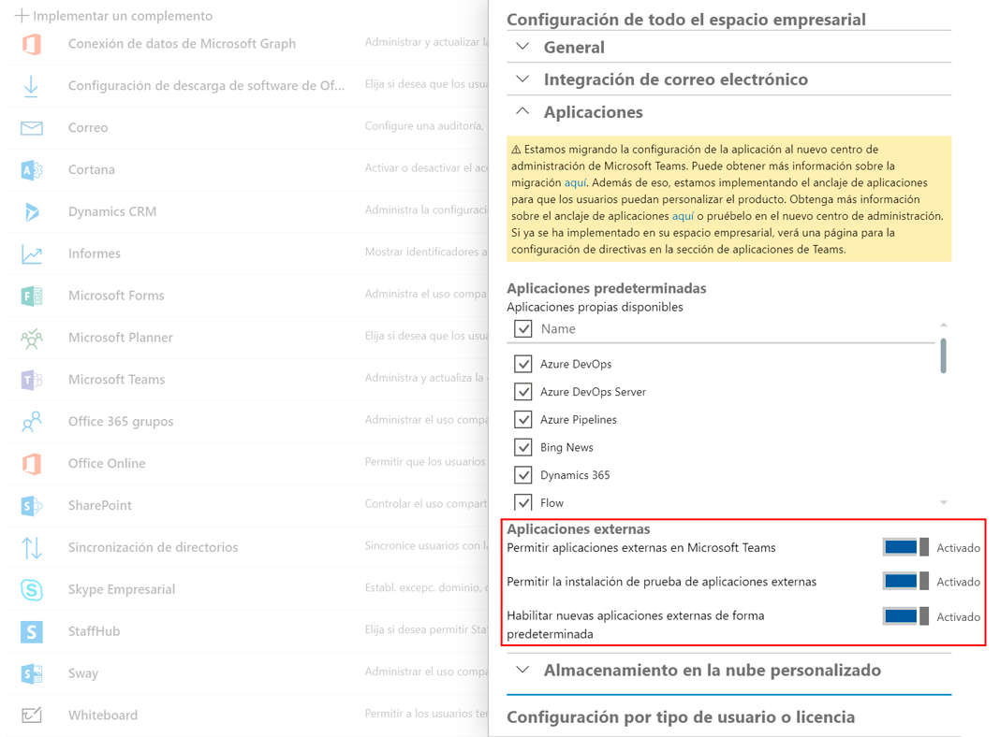

# xFx Un Framework para dominarlos a todos (SPS Madrid 2019 Workshop)

## Introducción

En este workshop vamos a desarrollar un webpart spfx que podrá ejecutarse tanto en SharePoint como en Teams.

Dicho webpart, nos va a permitir etiquetar un Team, usando un TermSet de SharePoint, almacenando dicha información 'extra' en una Schema extension de Graph. Además, el webpart nos va a permitir buscar otros Teams etiquetados con los mismos Tags.


_Nota_: xFx todavía no existe como tal, pero es el nombre con el que se empieza a conocer entra la comunidad _OfficeDev PnP_ a la posibilidad de que el mismo modelo de desarrollo para SharePoint, sirva para otras plataformas, como ya ocurre con Teams, y en un futuro podría ser Office, etc.

## Creación de una Schema Extension en MS Graph API

Para guardar los Tags asociados al Team, vamos a utilizar una _Schema Extension_ en MS Graph API. Graph extensions permiten agregar información personalizada a entidades de Graph, como Users, Groups/Teams, Events, Mails, etc.

Para crear la extensión, recomendamos usar la herramienta Graph Explorer [https://developer.microsoft.com/en-us/graph/graph-explorer](https://developer.microsoft.com/en-us/graph/graph-explorer)

Primero asegurate de que das el permiso _Directory.AccessAsUser.All_ a Graph Explorer, y una vez hecho, debes hacer un POST a _https://graph.microsoft.com/v1.0/schemaExtensions_ con el siguiente _body_ (asegurate de actualizar los valores que correspondan)

| Parameter        | Type           | Description  |
| ------------- |-------------| -----|
| id | String | The unique identifier for the schema extension definition. You can assign a value in one of two ways: <ul><li>Concatenate the name of one of your verified domains with a name for the schema extension to form a unique string in this format, {domainName}_{schemaName}. As an example, contoso_mySchema. NOTE: Only verified domains under the following top-level domains are supported: .com,.net, .gov, .edu or .org.</li><li>Provide a schema name, and let Microsoft Graph use that schema name to complete the id assignment in this format: ext{8-random-alphanumeric-chars}_{schema-name}. An example would be extkvbmkofy_mySchema.</li></ul>This property cannot be changed after creation.
| owner | String | Aunque este parámetro es _optional_ cuando se usa el Graph Explorer, se debe establecer. El valor de dicho parámetro debe ser el _ClientId_ de cualquier aplicación registrada en el Azure Active Directory de nuestr Tenant. Sólo es necesario un registro básico, sin especificar nada relativo a permisos. Aquí tienes como registrar una App en Azure AD: [https://docs.microsoft.com/en-us/azure/active-directory/develop/quickstart-register-app](https://docs.microsoft.com/en-us/azure/active-directory/develop/quickstart-register-app)|

```js
POST https://graph.microsoft.com/v1.0/schemaExtensions
content-type: application/json
{
    "id": "spsmad19TeamsTagging",
    "description": "Adding Tags to Teams",
    "owner": "bbb1b0ef-2f6b-4b50-bcc9-b6a062f202c2",
    "targetTypes": [
        "Group"
    ],
    "properties": [
        {
            "name": "tag1", "type": "String"
        },
        {
            "name": "tag2", "type": "String"
        },
        {
            "name": "tag3", "type": "String"
        }
    ]
}
```

En algunos casos, durante la semana previa al _workshop_ nos hemos encontrado con una respuesta 500 al crear la Schema Extension:
```json
{
    "error": {
        "code": "InternalServerError",
        "message": "Value cannot be null.\r\nParameter name: o",
        "innerError": {
            "request-id": "5ef53ad8-0bc8-436d-8385-5761b91c3e98",
            "date": "2019-06-17T06:38:56"
        }
    }
}
```

Sin embargo, a pesar del mensaje de error, la extensión acababa creándose. Puedes comprobar si la extensión se ha creado, con la siguiente query:
```js
https://graph.microsoft.com/v1.0/schemaExtensions?$filter=owner eq 'YOUR_OWNER_ID_HERE'
```

__Nota__: Lo más probable es que hayas creado la extensión utilizando un __id__ que no incluía un dominio verificado, por lo que el ID de la extensión se habrá autogenerado como: __ext{8-random-alphanumeric-chars}_{schema-name}__. Si no has obtenido el error 500, el _id_ generado se mostrará en la respuesta. Si obtuviste el error, entonces el ID lo puedes averiguar con la Query anterior que filtra las Schema extensions creadas por un owner.

__Copia y guarda el _id_ generado, ya que lo necesitaremos más adelante en nuestro código spfx__

## Creación proyecto spfx

Antes de nada, debemos crear un proyecto spfx usando la plantilla de Yeoman:

```powershell
yo @microsoft/sharepoint --plusbeta
```
- Accept the default __react-teams-tagging__ as your solution name, and then select Enter.
- Select SharePoint Online only (latest), and then select Enter.
- Select Use the current folder as the location for the files.
- __Select Y to ensure that your web part is automatically deployed tenant wide when it's added to the tenant app catalog.__
- Select N on the question if solution contains unique permissions.
- Select WebPart as the client-side component type to be created.

- Enter __TeamsTagging__ for the web part name, and then select Enter.
- Enter "_Webpart to Tag Teams based on a SharePoint TermSet_" as the description of the web part, and then select Enter.
- Enter __React__ option for the framework, and then select Enter to continue.

Despues de unos pocos minutos, tendremos disponible nuestro proyecto spfx base creado. Ya podemos pasar a editar nuestro codigo.

## Obteniendo datos de una Schema Extension en spfx

Nuestro webpart va a permitir seleccionar los tags de un TermSet específico en SharePoint, así que primero de todo vas a necesitar crear un TermSet específico en tu tenant de SharePoint (o reutilizar alguno existente, si lo prefieres). Coge el _id_ de ese TermSet, ya que también vamos a necesitar referenciarlo en nuestro código. El TermSet id será configurado como una propiedad de nuestro webpart, así que asegurate de actualizar la siguiente interfaz:

```ts
export interface ITeamsTaggingWebPartProps {
  termSetId: string;
}
```

Nuestro componente React va a necesitar realizar varias llamadas a la API Graph. Para ello, haremos uso del objeto _graphHttpClient_ disponible en el contexto. Para ello, debemos pasar ese objeto desde nuestro webpart, al componente spfx, así que primero de nada vamos a añadir una propiedad más a la interfaz del componente React, junto con el TermSet ID, que también pasará desde el webpart, al componente React (edita el fichero _ITeamsTaggingProps.ts_)

```ts
export interface ITeamsTaggingProps {
  termSetId: string;
  context: WebPartContext;
}
```

Ahora, podemos actualizar la function _render_ de nuestro webpart para pasar el termSetId y context (donde tendremos el graphHttpClient) a nuestro componente React:

```ts
  public render(): void {
    const element: React.ReactElement<ITeamsTaggingProps > = React.createElement(
      TeamsTagging,
      {
        termSetId: this.properties.termSetId,
        context: this.context
      }
    );

    ReactDom.render(element, this.domElement);
  }
```

Nuestro componente React va a mantener en el estado la lista de los Tags seleccionados, así como una lista de los Teams que tienen Tags similares, así que necesitamos crear un nuevo fichero: _./components/ITeamsTaggingState.ts_, con el siguiente código:

```ts
import { ITeamInfo } from "./ITeamsTaggingProps";
import { IPickerTerms } from "@pnp/spfx-controls-react/lib/TaxonomyPicker";

export interface ITeamsTaggingState {
  similarTeams: ITeamInfo[];
  tags: IPickerTerms;
  tagsUpdatedResult: string;
}
```

La interfaz del webpart, va a hacer uso de los componentes React del PnP, en concreto del TaxonomyPicker, así que necesitamos instalar el paquete haciendo uso de _npm_, para ello ejecuta:

```powershell
npm install --save @pnp/spfx-controls-react
```

El webpart mostrará un Taxonomy picker para que el usuario seleccione los Tags (o vea los que se guardaron), además de un botón para guardar los nuevos tags seleccionados, y otro botón para buscar Teams que tienen los mismos Tags. Actualiza el método _render_ del componente React con el siguiente código:

```ts
  public render(): React.ReactElement<ITeamsTaggingProps> {

    let similarTeams: any;
    if (this.state.similarTeams.length > 0) {
      similarTeams = <div><h3>Similar teams:</h3><ul>
        {this.state.similarTeams.map(t => <li>{t.name} ({t.tags.map(tag => <span>{tag}, </span>)}) </li>)}
      </ul></div>;
    }

    return (
      <div className={styles.teamsTagging}>
        <div className={styles.container}>
          <div className={styles.row}>
            <div className={styles.column}>

              <div>
                <TaxonomyPicker allowMultipleSelections={true}
                  termsetNameOrID={this.props.termSetId}
                  panelTitle="Select Term"
                  label="Select Tags for Team/Group..."
                  context={this.props.context}
                  onChange={this._onTaxPickerChange}
                  isTermSetSelectable={false}
                  initialValues={this.state.tags} />

                <DefaultButton
                  primary={true}
                  text="Update Team Tags"
                  onClick={this._updateTeamTags}
                />

                <p>{this.state.tagsUpdatedResult}</p>
              </div>
            </div>
          </div>

          <div className={styles.row}>
            <div className={styles.column}>
              <DefaultButton
                primary={true}
                text="Find similar Teams *"
                onClick={this._findSimilarTeams}
              />
              * (only using 1st tag)
              {similarTeams}
            </div>
          </div>
        </div>
      </div>
    );
  }
```

Para obtener los Tags almacenados, primero necesitamos hacer una llamada a MS Graph, cosa que haremos dentro del método de componente _componentDidMount_, que se ejecuta una vez el componente ya está montado, y que es el sitio idóneo para hacer llamadas asíncronas y obtener datos al "cargar" el componente:

```ts
  public componentDidMount(): void {
    this._getTeamTags().then((value) => {
      console.log(value);
      this.setState({
        tags: value
      });
    });
  }
```

Antes de ver la función _getTeamTags_, tan solo comentar que el Taxonomy picker necesita la siguiente información de un Term para poder enlazarlo al control:
- key: term id
- name: label del Term
- path: part to the Term
- termSet: id of the TermSet

Siendo así, vamos a necesitar un par de funciones para hacer una especie de Serialize / Deserailize de esta información, ya que la info almacenada en Graph, será un simple string por cada Term (en el ejemplo tendremos un máximo de 3 Tags/Terms):

```ts
  private _toIPickerTerm(input: string): IPickerTerm
  {
    const parts: string[] = input.split(this.separator);
    const pickerTerm: IPickerTerm = {
      key: parts[0],
      name: parts[1],
      path: parts[2],
      termSet: parts[3]
    };
    return pickerTerm;
  }

  private _serializeIPickerTerm(term: IPickerTerm): string {
    return `${term.key}${this.separator}${term.name}${this.separator}${term.path}${this.separator}${term.termSet}`;
  }
```

Al principio del componente añade el siguiente código para definir el _separator_ que utilizaremos a la hora de Serialize / Deserialize:
```ts
  private readonly separator: string = "__";
```

Ahora definimos la función para obtener datos de nuestra Schema extensión (actualiza el ID de tu Schema extension __SCHEMA_EXTENSION_ID__, tanto en la llamada, como en el objeto de respuesta):

```ts
  private async _getTeamTags(): Promise<IPickerTerms> {
    const groupId: Guid = this.props.context.pageContext.site.group.id;

    const response: HttpClientResponse = await this.props.context.graphHttpClient.get(
      `v1.0/groups/${groupId}/?$select=id,displayName,SCHEMA_EXTENSION_ID`,
      GraphHttpClient.configurations.v1);

    const responseJson: any = await response.json();

    let tags: IPickerTerms = [];
    if (responseJson.SCHEMA_EXTENSION_ID.tag1) tags.push(this._toIPickerTerm(responseJson.SCHEMA_EXTENSION_ID.tag1));
    if (responseJson.SCHEMA_EXTENSION_ID.tag2) tags.push(this._toIPickerTerm(responseJson.SCHEMA_EXTENSION_ID.tag2));
    if (responseJson.SCHEMA_EXTENSION_ID.tag3) tags.push(this._toIPickerTerm(responseJson.SCHEMA_EXTENSION_ID.tag3));

    return tags;
  }
```
## Guardando los Tags/Terms seleccionados en nuestra custom Schema extension

En esta sección vamos a ver cómo podemos guardar nuestros tags en la Schema Extension de un Team concreto. Para ello, añadimos el siguiente código a nuestro componente React. Básicamente, lo que necesitamos es hacer un PATCH al endpoint de Graph para el Team/Group específico: _v1.0/groups/${groupId}_
En el body de la request, especificaremos un JSON similar a:

```js
{
        "inheritscloud_TeamsTagging": {
          "tag1": '9237a3f0-9063-4348-a85c-7b9178a3bd9a__Marketing__Marketing__4a076cae-831c-4882-9b54-0f54f888e1fc',
          "tag2": 'c80f2e9a-0d2b-4134-9032-2a4c9ed320a0__Guides__Guides__4a076cae-831c-4882-9b54-0f54f888e1fc',
          "tag3": ''
        }
}
```

```ts
  private async _updateTeamTags(): Promise<void> {
    const updated: any = await this._updateExtensionInGroup();
    if (updated === 204) {
      this.setState({
        tagsUpdatedResult: 'Team tags updated successfully!'
      });
    } else {
      console.log("Error updating data");
    }
  }

  private async _updateExtensionInGroup(): Promise<any> {

    const httpClientOptions: IGraphHttpClientOptions = {
      method: "PATCH",
      body: JSON.stringify({
        "inheritscloud_TeamsTagging": {
          "tag1": this.state.tags[0] ? this._serializeIPickerTerm(this.state.tags[0]) : '',
          "tag2": this.state.tags[1] ? this._serializeIPickerTerm(this.state.tags[1]) : '',
          "tag3": this.state.tags[2] ? this._serializeIPickerTerm(this.state.tags[2]) : ''
        }
      })
    };

    const groupId: Guid = this.props.context.pageContext.site.group.id;

    const response: HttpClientResponse = await this.props.context.graphHttpClient.fetch(
      `v1.0/groups/${groupId}`,
      GraphHttpClient.configurations.v1,
      httpClientOptions);

    return response.status;
  }
```

## Buscando Teams con Tags similares

Nuestro webpart nos ofrece la posibilidad de buscar Teams que tengan los mismos Tags que el Team actual (para el caso del Workshop, lo haremos usando sólo el primer Tag almancenado, pero podríamos modificar la query y hacerlo tan complejo como queramos).

Una de las ventajas de utilizar un Schema extenion, es que las propiedades pueden utilizarse el filtrados, pudiendo hacer algo como:

```js
v1.0/groups/?$filter=inheritscloud_TeamsTagging/tag1 eq 'TAG_VALUE_HERE'
```

Asi pues, definimos la siguiente función para lanzar una query de búsqueda a Graph, filtrando los Teams/Groups que tienen el mismo valor en el primer Tag asignado.

Antes de añadir la función, vamos a definir una Interfaz para tipar mínimamente el resultado de la query. Editaremos el fichero _ITeamsTaggingProps.ts_ definiendo la siguiente interfaz:

```ts
export interface ITeamInfo {
  id: string;
  name: string;
  tags: string[];
}
```

Ahora ya sí, actualizamos el código de nuestro componente React con la siguiente función, que será invocada desde el botón de _Find similar teams_
(__actualiza el id de la extension__, tanto en la query como en el objeto JSON de respuesta)

```ts
  private async _findSimilarTeams(): Promise<void> {
    const tag1: string = this._serializeIPickerTerm(this.state.tags[0]);

    const response: HttpClientResponse = await this.props.context.graphHttpClient.get(
      `v1.0/groups/?$filter=inheritscloud_TeamsTagging/tag1 eq '${tag1}'&$select=id,displayName,inheritscloud_TeamsTagging`,
      GraphHttpClient.configurations.v1);

    const responseJson: any = await response.json();

    const similarTeams = responseJson.value.map((team) => {
      let tags: IPickerTerms = [];

      if (team.inheritscloud_TeamsTagging.tag1) tags.push(this._toIPickerTerm(team.inheritscloud_TeamsTagging.tag1));
      if (team.inheritscloud_TeamsTagging.tag2) tags.push(this._toIPickerTerm(team.inheritscloud_TeamsTagging.tag2));
      if (team.inheritscloud_TeamsTagging.tag3) tags.push(this._toIPickerTerm(team.inheritscloud_TeamsTagging.tag3));

      const similarTeam: ITeamInfo = {
        id: team.id,
        name: team.displayName,
        tags: tags.map((t: IPickerTerm) => t.name)
      };
      return similarTeam;
    });

    this.setState({
      similarTeams: similarTeams
    });
  }
```

Finalmente, ya sólo queda definir el constructor de nuestro componente React, ya que necesitamos inicializar el estado del componente a unos valores por defecto, así como hacer el _binding_ correcto de los botones de la interfaz:

```ts
  constructor(props: ITeamsTaggingProps) {
    super(props);

    this._findSimilarTeams = this._findSimilarTeams.bind(this);
    this._updateTeamTags = this._updateTeamTags.bind(this);
    this._onTaxPickerChange = this._onTaxPickerChange.bind(this);

    this.state = {
      similarTeams: [],
      tags: [],
      tagsUpdatedResult: ''
    };
  }
  ```


Si llegado este punto, tienes cualquier problema con el código, puedes compararlo con este repo de Github:
[https://github.com/SharePoint/sp-dev-fx-webparts/tree/master/samples/react-teams-tagging](https://github.com/SharePoint/sp-dev-fx-webparts/tree/master/samples/react-teams-tagging)

Como último paso, aunque podemos hacerlo en tiempo de configuración del webpart, vamos a añadir el ID de nuestro TermSet de SharePoint, como valor predeterminado en la propiedade del webpart que creamos al principio:

- edita el fichero _TeamstaggingWebPart.manifest.json_
- dentro de _preconfiguredEntries/properties_ añade el siguiente JSON:
```json
"properties": {
      "termSetId": "SP_TERMSET_ID"
    }
```

## Despliegue y configuración en Teams

Para poder desplegar nuestro webpart en Teams es necesario poder proporcionarle contexto de Teams más allá del que ya tenemos en SharePoint. Para ello, tendremos que hacer lo siguiente:

### 1. Modificar archivo `TeamsTaggingWebPart.ts`

Importamos la librería de Microsoft Teams:

```ts
import * as microsoftTeams from '@microsoft/teams-js';
```

Declararemos la siguiente variable:

```ts
private _teamsContext: microsoftTeams.Context;
```

E inicializaremos el webpart con el siguiente código:

```ts
  protected onInit(): Promise<any> {
    let retVal: Promise<any> = Promise.resolve();
    if (this.context.microsoftTeams) {
      retVal = new Promise((resolve, reject) => {
        this.context.microsoftTeams.getContext(context => {
          this._teamsContext = context;
          resolve();
        });
      });
    }
    return retVal;
  }
```

### 2. Modificar el archivo `TeamsTaggingWebPart.manifest.json`

Modificaremos la propiedad `"supportedHosts"` para indicarle que también se puede desplegar en Teams con `"TeamsTab"`.

```json
"supportedHosts": ["SharePointWebPart", "TeamsTab"],
```

### 3. Crear el archivo `manifest.json`

Cuando creamos nuestro webpart, quizá hayamos visto que nuestro webpart tiene una carpeta llamada `"teams"` dentro de la solución que contiene dos imágenes, que no son más que los iconos que tendrá nuestra aplicación. En ella, crearemos nuestro archivo `manifest.json`: 


Y lo rellenamos con la información de un manifest.json que os dejamos de ejemplo. Recordad cambiar todos aquellas propiedades indicadas con `{{SPFX_COMPONENT_XXX}}`:

```json
{
  "$schema": "https://developer.microsoft.com/en-us/json-schemas/teams/v1.2/MicrosoftTeams.schema.json",
  "manifestVersion": "1.2",
  "packageName": "{{SPFX_COMPONENT_ALIAS}}",
  "id": "aa3fecf0-1fd0-4751-aba1-12314dc3a22f",
  "version": "0.1",
  "developer": {
    "name": "Luis Mañez & Angel Carrillo",
    "websiteUrl": "https://products.office.com/en-us/sharepoint/collaboration",
    "privacyUrl": "https://privacy.microsoft.com/en-us/privacystatement",
    "termsOfUseUrl": "https://www.microsoft.com/en-us/servicesagreement"
  },
  "name": {
    "short": "{{SPFX_COMPONENT_NAME}}"
  },
  "description": {
    "short": "{{SPFX_COMPONENT_SHORT_DESCRIPTION}}",
    "full": "{{SPFX_COMPONENT_LONG_DESCRIPTION}}"
  },
  "icons": {
    "outline": "{{SPFX_COMPONENT_ID}}_outline.png",
    "color": "{{SPFX_COMPONENT_ID}}_color.png"
  },
  "accentColor": "#004578",
  "configurableTabs": [
    {
      "configurationUrl": "https://{teamSiteDomain}{teamSitePath}/_layouts/15/TeamsLogon.aspx?SPFX=true&dest={teamSitePath}/_layouts/15/teamshostedapp.aspx%3FopenPropertyPane=true%26teams%26componentId={{SPFX_COMPONENT_ID}}%26forceLocale={locale}",
      "canUpdateConfiguration": true,
      "scopes": [
        "team"
      ]
    }
  ],
  "validDomains": [
    "*.login.microsoftonline.com",
    "*.sharepoint.com",
    "*.sharepoint-df.com",
    "spoppe-a.akamaihd.net",
    "spoprod-a.akamaihd.net",
    "resourceseng.blob.core.windows.net",
    "msft.spoppe.com"
  ],
  "webApplicationInfo": {
    "resource": "https://{teamSiteDomain}",
    "id": "00000003-0000-0ff1-ce00-000000000000"
  }
}
```

__NOTA:__ El valor de `{{SPFX_COMPONENT_ID}}` lo podréis sacar de vuestro archivo `TeamsTaggingWebPart.manifest.json`, en la propiedad `id`.

Con esto, ya tendremos disponible nuestro webpart para ser publicado.

### 4. Publicar la aplicación en el App Catalog de SharePoint

Los webparts de Teams se han de publicar como cualquier otro webpart de SPFx y para ello tendremos que ir al SharePoint App Catalog (o al _Site Collection App Catalog_), donde subiremos nuestro paquete `.sppkg`, marcaremos la opción de _Hacer que esta solución esté disponible en todos los sitios de la organización_ y la implementaremos.


### 5. Instalar la aplicación en un sitio de SharePoint (_Office 365 Group_)

Posteriormente, iremos al sitio de SharePoint del grupo de Office 365 del que hemos creado nuestro almacén de términos e instalaremos nuestra aplicación.


#### OPCIONAL

Podemos desplegar nuestro webpart en una página de SharePoint para ver el resultado:


### 6. Permitir aplicaciones externas en Teams

Antes de pasar a Teams, tendremos que habilitar en el Centro de Administración de Microsoft 365 el poder permitir aplicaciones externas e instalaciones de prueba. Para ello iremos a `https://admin.microsoft.com` y en el menú de la izquierda pincharemos en _Mostrar Todo_ > _Configuración_ > _Servicios y complementos_ y seleccionaremos "Microsoft Teams" del listado.


Se nos abrirá un panel lateral donde buscaremos la opción de "Aplicaciones Externas" y activaremos los tres sliders.



### 7. Despliegue de nuestra app en Teams

Por fin llegamos a Teams :) Para poder instalar nuestra aplicación nos iremos al equipo donde queramos instalarla, mostraremos su menú y pincharemos en la opción de "Administrar equipo".


Posteriormente nos iremos a la pestaña de "Aplicaciones", donde veremos un enlace en la parte inferior derecha que indica `Cargar una aplicación personalizada`. Haremos click en él.


Se nos abrirá una ventana del explorador para que indiquemos el archivo comprimido de nuestra aplicación que subiremos a Teams. Para ello, sólo tendremos que ir a nuestra solución de SPFx y comprimir en formato .zip los archivos que se encuentran dentro de la carpeta "teams".


Una vez lo hayamos subido, aparecerá entre nuestras aplicaciones instaladas.


### 8. Creación de pestaña en Teams con nuestra app

Si el despliegue ha ido correcto, aparte de verlo en el listado de nuestras aplicaciones instaladas, deberá aparecernos al intentar añadir una nueva pestaña dentro de nuestro canal.


Guardaremos los cambios de las siguientes pantallas que nos aparezcan...


...¡y ya tendremos nuestro webpart disponible para ser usado dentro de Teams!


